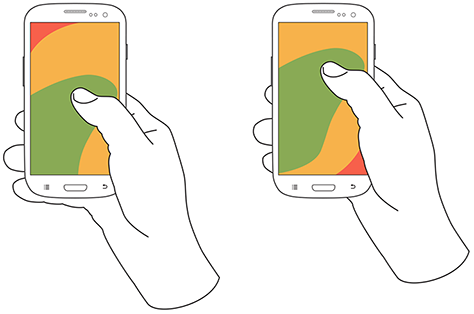

# Placer une Navbar en bas : Pourquoi ?

🚨🚨🚨En format mobile, préfère placer ta navbar en bas de l'écran🚨🚨🚨

## L’importance de la navigation placée en bas sur un appareil mobile

:::info

L'accessibilité ne se limite pas aux choix de couleurs, au positionnement des éléments etc...
C'est aussi le côté pratique et l'utilisation d'une application.

:::

Si tu prends, par exemple, _LinkedIn_ ou _WhatsApp_ sur ton téléphone, tu remarqueras que **la barre de navigation se trouve en bas** !

Cela ne doit rien au hasard :

Si tu prends ton téléphone d'une seule main, tu auras du mal à accéder au menu si il se situe en haut. Alors qu'en bas, ce sera nettement plus facile de cliquer sur les icônes ou onglets qui t'intéressent...

:::::info
Il existe une recherche réalisée par **_Steven Hoober_** qui explique la façon dont les utilisateurs se servent de leurs doigts sur mobile.

::::tip [Lien de l'étude](https://www.uxmatters.com/mt/archives/2013/02/how-do-users-really-hold-mobile-devices.php)

| Méthode d'utilisation | Pourcentage |
| --------------------- | ----------- |
| 1 main / 1 doigt      | 49%         |
| En berceau            | 36%         |
| 2 mains               | 15%         |

:::note[La manière de tenir un téléphone 'en berceau' siginfie que l'utilisateur prend son appreil au creux d'une main, et intéragit avec l'autre.]

:::

::::

:::::

## Schéma de l’utilisation du mobile avec les mains

Avec ce schéma, on comprend facilement que l’utilisation du pouce est donc à optimiser dans l’UX et que _placer le menu dans en bas de l'écran_ **est indispensable** pour créer des interactions de navigation.

### Résumé et bonnes pratiques UX

- Elle doit être positionnée en bas
- Elle doit être lisible, claire et simple
- Elle doit être discrète (s’efface au scroll)
- Elle doit faire le lien avec les actions principales de la stratégie digitale voulue par le client
