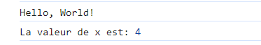
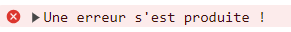
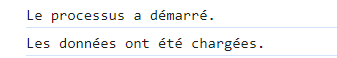
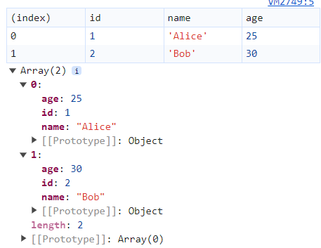
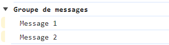

# Utilisation de `console` en JS

JavaScript fournit plusieurs méthodes pour afficher des informations dans la console du navigateur. Voici un aperçu des différentes méthodes de `console.log` et leurs utilisations.

[Voir sur CodePen](https://codepen.io/Chrstn67/pen/ZEdwrwd)

## `console.log()`

### Description

La méthode `console.log()` est la plus courante pour afficher des messages dans la console.

### Exemple

```javascript
const x = 4;
console.log("Hello, World!");
console.log("La valeur de x est:", x);
```

##### Affichage dans la console



### Usage

- Afficher des messages d'information générale.
- Debugging basique.

## `console.warn()`

### Description

La méthode `console.warn()` affiche des messages d'avertissement dans la console. Ceux-ci apparaissent souvent avec un icône d'avertissement et peuvent être stylisés différemment selon le navigateur.

### Exemple

```javascript
console.warn("Ceci est un avertissement !");
```

##### Affichage dans la console


### Usage

- Indiquer des problèmes potentiels.
- Mettre en garde sur des pratiques déconseillées.

## `console.error()`

### Description

La méthode `console.error()` affiche des messages d'erreur. Ces messages sont souvent stylisés pour attirer l'attention, par exemple en rouge.

### Exemple

```javascript
console.error("Une erreur s'est produite !");
```

##### Affichage dans la console



### Usage

- Signaler des erreurs qui doivent être corrigées.
- Debugging avancé.

## `console.info()`

### Description

La méthode `console.info()` est utilisée pour afficher des messages d'information. Ils sont similaires à `console.log()`, mais peuvent être stylisés différemment selon le navigateur.

### Exemple

```javascript
console.info("Le processus a démarré.");
console.info("Les données ont été chargées.");
```

##### Affichage dans la console



### Usage

- Fournir des informations supplémentaires.
- Messages informatifs qui ne sont pas critiques.

## `console.table()`

### Description

La méthode `console.table()` affiche les données sous forme de tableau, ce qui peut être très utile pour visualiser des objets ou des tableaux de manière structurée.

### Exemple

```javascript
const users = [
  { id: 1, name: "Alice", age: 25 },
  { id: 2, name: "Bob", age: 30 },
];
console.table(users);
```

##### Affichage dans la console



### Usage

- Visualisation de données tabulaires.
- Debugging de structures de données complexes.

## `console.group()` et `console.groupEnd()`

### Description

Les méthodes `console.group()` et `console.groupEnd()` permettent de grouper des messages dans la console. Cela aide à organiser et hiérarchiser les sorties.

### Exemple

```javascript
console.group("Groupe de messages");
console.log("Message 1");
console.log("Message 2");
console.groupEnd();
```

##### Affichage dans la console



### Usage

- Organiser des messages connexes.
- Structurer les sorties de debugging.

## `console.time()` et `console.timeEnd()`

### Description

Les méthodes `console.time()` et `console.timeEnd()` permettent de mesurer le temps d'exécution entre deux points dans le code.

### Exemple

```javascript
console.time("Temps de boucle");
for (let i = 0; i < 1000; i++) {
  // Code à mesurer
}
console.timeEnd("Temps de boucle");
```

##### Affichage dans la console


### Usage

- Mesurer les performances du code.
- Optimisation du temps d'exécution.

---

En utilisant ces différentes méthodes de `console`, tu peux améliorer le debugging et le développement de tes applications JavaScript. Chaque méthode a ses propres cas d'utilisation et peut t'aider à organiser et analyser tes messages dans la console de manière plus efficace.
