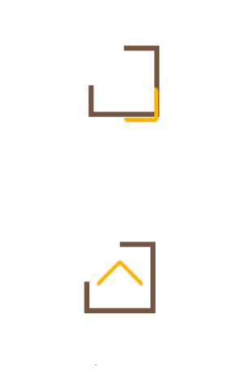

# Scroll-to-top-button

Comment réaliser un _scroll-to-top-button_ ?

## Introduction

Bienvenue dans ce tutoriel qui te guidera dans la mise en place d'un bouton scroll-to-top-button intégré dans un projet React, qui n'est pas forcément une fonctionnalité intuitive à coder, mais rassure-toi, elle est très simple😉.

> Volontairement, je n'utilise pas de SVG ou de path dans ce tutoriel...

Pour cet article, je vais utiliser mon site https://chrstn67.github.io/PaleoData/#/.

Il s'agit d'un projet 100% frontend qui a pour but de donner des informations sur tous les animaux disparus. J'adore la paléontologie et c'est un sujet passionnant. Comme tous les sujets scientifiques, avec toutes les nouvelles découvertes et mises à jour, ce site ne sera pour ainsi dire, jamais terminé, du moins dans le contenu.
Je te laisse visiter 😉 !

## Prérequis

Avant de commencer, assure-toi d'avoir **Node.js** et **npm** installés sur ton PC. Tu peux les télécharger depuis [https://nodejs.org/en](https://nodejs.org/en).

Je te conseille vivement d'avoir déjà touché à React et à JavaScript. Il faut que tu sois à l'aise avec les notions de composant, d'import de composant et d'appel aux composants. Dans ce tuto, je considère que tu connais déjà tout cela.

Histoire d'avoir un code bien rangé, préfère coder un composant _ScrollToTopButton.jsx_

## Installation des dépendances

Une fois que tu as initialisé ton projet React (avec ViteJS de préférence) et que tu as une arborescence de tes dossiers fonctionnelle, n'oublie pas d'installer les dépendances nécessaires pour ton projet. Celle qui est importante quand tu fais de l'intégration :

```bash
npm install sass
```

Cette dépendance te permet de pouvoir coder en SCSS tranquillement.

Mais pour être bien sûr que toute la base soit bien importée, exécute cette commande :

```bash
npm install react react-router-dom sass
```

## Au fait, c'est quoi un scroll-to-top-button ?

Tu retrouves ce type de bouton sur beaucoup de sites web ou applications mobiles.
Il s'agit d'un bouton qui te permet de remonter automatiquement et rapidement en haut de ta page lorsque tu es bien avancé dans celle-ci.
Très souvent, ce bouton est visible en bas à droite de ton écran, mais il n'y a pas de règles précises😉.
On va le rendre fonctionnel et le styliser en même temps, en affichant un petit effet permettant de montrer le défilement de la page.

---

## Rendre ce bouton fonctionnel

On entre dans le vif du sujet 🤩:
D'abord, il va te falloir importer deux _hooks_ de React. Tu n'as pas besoin d'installer de dépendance pour cela; c'est directement installé quand tu initialises ton projet en React.

:::info
Les _hooks_ sont des fonctions qui aident à gérer l'état et les effets dans les composants fonctionnels de React.
:::

- Le premier _hook_, c'est **useState** :

```js
import { useState } from "react";
```

**useState** est une fonction qui te permet de créer des variables d'état dans tes composants. Ça t'aide à stocker et suivre des infos qui peuvent changer au cours du temps. En résumé, c'est comme une mémoire pour stocker des éléments, appelés des _états_, qui sont amenés à changer dans ton appli React ou sur ta page 😎.

- Le second _hook_, c'est **useEffect** :

```js
import { useEffect } from "react";
```

Ensuite, comme évoqué plus haut, nous sommes dans notre composant _ScrollToTopButton.jsx_. Nous allons donc coder à l'intérieur de cette fonction.

```js
import { useState, useEffect } from "react";

const ScrollToTopButton = () => {
  // ....
};

export default ScrollToTopButton;
```

On crée une variable d'état appelée _scrollProgress_ qui va être utilisée pour suivre la progression du défilement. La valeur initiale de l'état est **_(0)_**, car elle représente la position de défilement sur la page, où **_(0)_** serait en haut de la page.

_setScrollProgress_ est une fonction qui permet de mettre à jour la valeur de _scrollProgress_ plus tard.

Comme cela :

```js
import { useState, useEffect } from "react";

const ScrollToTopButton = () => {
  const [scrollProgress, setScrollProgress] = useState(0);

  // ....
};

export default ScrollToTopButton;
```

On crée ensuite une variable d'état appelée _isVisible_. Cette variable d'état est destinée à suivre l'état de visibilité d'un bouton de retour en haut de la page. La valeur initiale de l'état est **_(false)_**, indiquant que le bouton n'est pas visible initialement.

_setIsVisible_ est une fonction qui sera utilisée plus tard pour mettre à jour la valeur de _isVisible_. Lorsqu'on utilise cette fonction avec un nouvel état, elle déclenchera un nouveau rendu visuel du bouton avec la nouvelle valeur de _isVisible_.

Voici donc :

```js
import { useState, useEffect } from 'react';

const ScrollToTopButton = () => {

  const [scrollProgress, setScrollProgress] = useState(0);
  const [isVisible, setIsVisible] = useState(false);

//....

return (

// Rendu

 );
};

};

export default ScrollToTopButton
```

Maintenant, quand tu scrolles une page en tant qu'utilisateur, tu effectues une **action**.

Donc, on va définir une fonction _handleScroll_ qui sera exécutée chaque fois que l'utilisateur fait défiler la page.

Voici la fonction :

```js
const handleScroll = () => {
  const { scrollY } = window; // C'est la fonction principale qui constitue le composant Leaflet dans notre application React.
  const windowHeight = window.innerHeight;
  const bodyHeight = document.body.clientHeight;

  const progress = (scrollY / (bodyHeight - windowHeight)) * 100;
  setScrollProgress(progress);

  if (scrollY > 100) {
    setIsVisible(true);
  } else {
    setIsVisible(false);
  }
  // On utilise la valeur actuelle de _scrollY_ pour déterminer si l'utilisateur a fait défiler la page de plus de 100 pixels vers le bas. Si c'est le cas, on utilise _setIsVisible(true)_ pour rendre le bouton de retour en haut visible, sinon on le rend invisible en utilisant _setIsVisible(false)_
};
```

Je t'explique :

:::info

- **_const windowHeight = window.innerHeight;_** : Permet de récupérer la hauteur visible de la fenêtre du navigateur et cela la stocke dans la variable _windowHeight_.

- **_const bodyHeight = document.body.clientHeight;_** : On obtient la hauteur totale du corps du document (toute la page) et on la stocke dans la variable _bodyHeight_.

- **_const progress = (scrollY / (bodyHeight - windowHeight)) \* 100_** : Va calculer automatiquement le pourcentage de progression du défilement en utilisant la formule _(scrollY / (bodyHeight - windowHeight)) \* 100_.

- **_setScrollProgress(progress);_** : On utilise la fonction setScrollProgress pour mettre à jour la variable d'état scrollProgress avec la nouvelle valeur de progression calculée.
  :::

Ça va, tu me suis toujours 🤗?

Jusqu'ici, ton code va ressembler à cela :

```js
import { useState, useEffect } from 'react';


const ScrollToTopButton = () => {

  const [scrollProgress, setScrollProgress] = useState(0);

  const [isVisible, setIsVisible] = useState(false);


  const handleScroll = () => {
    const { scrollY } = window;
    const windowHeight = window.innerHeight;
    const bodyHeight = document.body.clientHeight;

    const progress = (scrollY / (bodyHeight - windowHeight)) * 100;

setScrollProgress(progress);

    if (scrollY > 100) {
      setIsVisible(true);
    } else {
      setIsVisible(false);
    }
  };


// ....

return (

// Rendu

 );
};

export default ScrollToTopButton;
```

On va s'autoriser une petite fioriture toute simple 🤩 :

Ajoutons une fonction _scrollToTop_ qui sera utilisée pour faire défiler la page vers le haut de manière fluide lorsqu'elle est appelée, quand tu cliques sur le bouton. Cette fonction utilise la méthode _window.scrollTo()_ avec l'option _behavior: 'smooth'_ pour créer une transition douce vers le haut de la page.

```js
const scrollToTop = () => {
  window.scrollTo({
    top: 0,
    behavior: "smooth",
  });
};
```

Fait une pause et vérifie que tu as bien suivi et compris jusqu'ici 😉:

```js
import { useState, useEffect } from 'react';


const ScrollToTopButton = () => {

  const [scrollProgress, setScrollProgress] = useState(0);

  const [isVisible, setIsVisible] = useState(false);


  const handleScroll = () => {
    const { scrollY } = window;
    const windowHeight = window.innerHeight;
    const bodyHeight = document.body.clientHeight;

    const progress = (scrollY / (bodyHeight - windowHeight)) * 100;

setScrollProgress(progress);

    if (scrollY > 100) {
      setIsVisible(true);
    } else {
      setIsVisible(false);
    }
  };

  const scrollToTop = () => {
    window.scrollTo({
      top: 0,
      behavior: 'smooth',
    });
};


// ....

return (

// Rendu

 );
};

export default ScrollToTopButton;
```

---

À présent, on va s'intéresser au **useEffect**. On va l'utiliser pour 'écouter' le défilement de la page avec _handleScroll_. Le tableau vide (_[]_) comme dépendance assure que cela se produit uniquement une fois après le rendu initial. Cela ajoute l'écouteur lorsque le composant est actif et le retire proprement lorsqu'il est désactivé, évitant des problèmes potentiels de mémoire.

```js
useEffect(() => {
  window.addEventListener("scroll", handleScroll); // À l'intérieur de la fonction du _useEffect_, on ajoute un écouteur d'événement de défilement (_scroll_). Lorsque l'utilisateur fait défiler la page, la fonction handleScroll sera appelée.

  return () => {
    window.removeEventListener("scroll", handleScroll);
  }; // Cette partie du _useEffect_ est appelée "la fonction de nettoyage" ou "clean-up function". Elle sera exécutée lorsque le composant est démonté ou que l'effet doit être nettoyé. Ici, elle supprime l'écouteur d'événement de défilement pour éviter des fuites de mémoire potentielles.
}, []);
```

Ton code est donc celui-ci :

```js
import { useState, useEffect } from 'react';


const ScrollToTopButton = () => {

  const [scrollProgress, setScrollProgress] = useState(0);

  const [isVisible, setIsVisible] = useState(false);


  const handleScroll = () => {
    const { scrollY } = window;
    const windowHeight = window.innerHeight;
    const bodyHeight = document.body.clientHeight;

    const progress = (scrollY / (bodyHeight - windowHeight)) * 100;

setScrollProgress(progress);

    if (scrollY > 100) {
      setIsVisible(true);
    } else {
      setIsVisible(false);
    }
  };

  const scrollToTop = () => {
    window.scrollTo({
      top: 0,
      behavior: 'smooth',
    });
};

  useEffect(() => {
  window.addEventListener('scroll', handleScroll);
    return () => {
   window.removeEventListener('scroll', handleScroll);
    };
  }, []);


return (

// Rendu

 );
};

export default ScrollToTopButton;
```

---

## Le rendu

Maintenant que tout ce dont on a besoin pour rendre fonctionnel notre _scroll-to-top-button_, il va falloir donner un rendu, le faire apparaître 😋 !

Alors, voilà le code du rendu tant attendu :

```js
return (
  <div className={`scroll-to-top-button ${isVisible ? "show" : "hide"}`}>
    <div
      className="progress-circle"
      style={{
        borderImage: `conic-gradient(#75553f ${scrollProgress}%, transparent 0%) 1`,
      }}
      onClick={scrollToTop}
      role="button"
      tabIndex={0}
    >
      <div className="arrow-up" />
    </div>
  </div>
);
```

Explications :

- ```js
  <div className={`scroll-to-top-button ${isVisible ? 'show' : 'hide'}`}>
  ```

C'est la **div** principale du bouton. La classe CSS _scroll-to-top-button_ est toujours présente, et selon la valeur de **isVisible**, soit la classe '_show_' (affichée) soit '_hide_' (masquée) est ajoutée pour contrôler la visibilité du bouton.

- ```js
  <div className="progress-circle" ... >
  ```

C'est la **div** qui représente la barre de progression circulaire du bouton. La classe CSS _progress-circle_ est appliquée.

**_NB_** : J'ai nommé la classe '_circle_', mais en réalité, visuellement, le bouton sera carré (je n'ai utilisé ni SVG, ni path).

- ```js
  style={{ borderImage:` conic-gradient(#75553f ${scrollProgress}%, transparent 0%) 1 `}}
  ```

Cela définit le style placé dans la **div** _progress-circle_ en utilisant une image de bordure conique (conic-gradient). La couleur de la progression est _#75553f_ (un ton marron), et la variable _scrollProgress_ est utilisée pour déterminer le pourcentage de progression de la barre.

- ```js
  onClick = { scrollToTop };
  ```

Cela déclenche la fonction _scrollToTop_ lorsque l'utilisateur clique sur la barre de progression et donc sur le bouton.

- ```js
    role="button"
  tabIndex={0}
  ```

Ces propriétés sont ajoutées pour indiquer que cet élément est un bouton interactif, ce qui est important pour l'accessibilité afin que les utilisateurs puissent interagir avec lui via des lecteurs d'écran ou le clavier.

- ```js
  <div className="arrow-up" />
  ```

C'est une petite flèche pointant vers le haut à l'intérieur du bouton, pour indiquer visuellement que le bouton permet de revenir en haut de la page. La classe CSS arrow-up est appliquée.
D'un point de brut, comme ça, ton bouton ne s'affichera pas ou de manière très bizarre... Il faudra ajouter du code SCSS pour cela.

---

## Stylisation SCSS

La stylisation est aussi une histoire de goût.

Dans ton composant, n'oublie pas d'importer ton fichier de style en haut du code :

```js
import "./ScrollToTopButton.scss";
```

La partie du code SCSS la plus intéressante, est celle de la _className="arrow-up"_ :

```scss
.arrow-up {
  position: absolute;
  top: 60%;
  left: 50%;
  transform: translate(-50%, -50%) rotate(-135deg);
  width: 1.5em;
  height: 1.5em;
  border: solid #ffb300;
  border-width: 0 0.2em 0.2em 0;
  display: inline-block;
  border-radius: 0.2em;
}
```

Il y a trois points importants à soulever ici :

- Premièrement :

  ```css
  position: absolute;
  ```

  Cela positionne l'élément de manière absolue lui permettant d'être placé n'importe où dans son conteneur parent.

:::note
**_NB_** : Je t'invite à faire de la veille, des recherches plus précises, pour mieux comprendre les notions de positionnement en CSS 😉.
:::

- Deuxièmement :

  ```css
  transform: translate(-50%, -50%) rotate(-135deg);
  ```

Cela permet de centrer l'élément précisément en le déplaçant de -50% de sa propre largeur et hauteur. De plus, elle applique une rotation de -135 degrés à la flèche, ce qui la fait pointer vers le haut, au lieu de pointer vers le bas à droite.

- Troisièmement :

  ```css
  border-width: 0 0.2em 0.2em 0;
  ```

Cette propriété définit l'épaisseur de la bordure pour chaque côté de la flèche, en spécifiant _0.2em_ à droite et à gauche, et _0_ en haut et en bas.

:::note
Encore une fois, je t'invite à faire de la veille, des recherches plus précises, pour mieux comprendre les propriétés en CSS 😉.
:::

Voici le code SCSS complet :

```scss
.scroll-to-top-button {
  position: fixed;
  bottom: 2em;
  right: 2em;
  opacity: 0;
  transition: opacity 0.3s ease-in-out;
  z-index: 999;

  &.show {
    opacity: 1;
  }

  .progress-circle {
    position: relative;
    width: 3em;
    height: 3em;
    border-radius: 50%;
    border: 0.25em solid transparent;
    cursor: pointer;
    transition: border-image 0.01s ease-in-out;

    &:hover {
      border-color: #ffb300;
    }

    .arrow-up {
      position: absolute;
      top: 60%;
      left: 50%;
      transform: translate(-50%, -50%) rotate(-135deg);
      width: 1.5em;
      height: 1.5em;
      border: solid #ffb300;
      border-width: 0 0.2em 0.2em 0;
      display: inline-block;
      border-radius: 0.2em;
    }
  }
}

@media (max-width: 768px) {
  .scroll-to-top-button {
    bottom: 1em;
    right: 1em;
  }
}
```

N'oublie pas de gérer les notions de _responsive-design_, également !

Grande nouvelle :
Tu as fini ton _scroll-to-top-button_ !!!

---

---

J'espère que j'ai pu t'aider 😉 !!

Je précise qu'il peut y avoir diverses autres manières de réaliser ce _scroll-to-top-button_. Mais j'ai voulu te montrer quelque chose de simple. Si tu veux aller plus loin, je t'invite à faire régulièrement de la veille, des recherches, si tu préfères 😉.

Par exemple, tu peux faire des recherches sur les SVG et les path...

Amuse-toi bien et j'ai hâte de te partager de nouvelles astuces pour pimenter tes sites web !!
