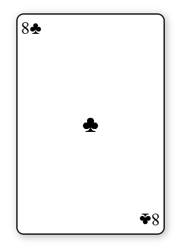
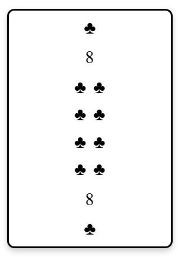
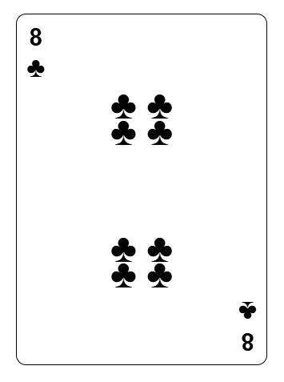
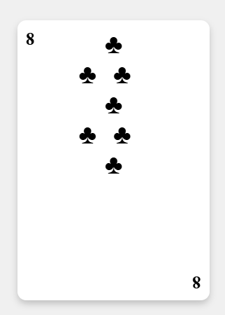
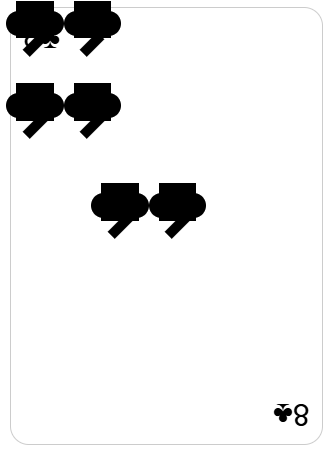
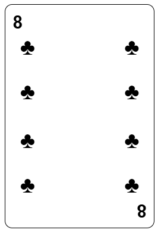

---
tags:
  [
    Intelligence Artificielle,
    IA,
    ChatGPT,
    Mistral AI,
    DeepSeek,
    Perplexity,
    ClaudeAI,
    v0,
  ]
---

# Comparatif de 6 IA

Découvre un comparatif du rendu de 6 IA présentes sur le marché, **_concernant le code_** (_ChatGPT_, _MistralAI_, _Perplexity_, _DeepSeek_, _ClaudeAI_, _v0_).

:::warning[RAPPEL / DISCALMER]

Dans tous les cas, une IA peut être très utile quand on souhaite pousser les raisonnements encore plus loin. **Dans tous les codes présents, il ne s'agit que du premier jet d'une demande**. Bien-sûr, j'aurais pu aller plus loin, mais ce n'était pas mon objectif dans cet exercice.

De plus, il est important de rappeler que _les IAs sont des outils_. Il faut donc les traiter en tant que tel.

Il m'arrive d'utiliser régulièrement 3 d'entre elles, et chacune m'aide d'une façon plus précise que l'autre.
:::

## HTML-CSS : Le test du 8 de trèfle

Dans cette section, l'objectif est de confronter 4 IA présentes sur le marché et de voir leur manière de coder, et donc par extention, de voir le visuel final.

À la base, un vrai 8 de trèfle ressemble à ceci:


Voici le prompt :

> _Je veux que tu me codes en HTML/CSS Nested, le 8 de trèfle d'une carte à jouer, exactement avec le même positionnement des formes des cartes classiques._

### ChatGPT

:::info[]
ChatGPT, développé par OpenAI, est un modèle de langage polyvalent avec 175 milliards de paramètres. Il excelle dans la génération de texte élaboré et nuancé, ce qui le rend particulièrement efficace pour :

- L'assistance à la rédaction créative
- La composition d'emails et d'essais
- La programmation informatique

Cependant, ChatGPT peut parfois fournir des réponses biaisées ou incorrectes et a tendance à spéculer au-delà de sa base de connaissances.
:::

[Regarde le rendu sur CodePen](https://codepen.io/Chrstn67/pen/PwYVEKV)

#### Code HTML

```html
<body>
  <div class="card">
    <div class="symbol top-left">8♣</div>
    <div class="symbol bottom-right">8♣</div>
    <div class="middle">
      <div class="symbol">♣</div>
      <div class="symbol">♣</div>
      <div class="symbol">♣</div>
      <div class="symbol">♣</div>
      <div class="symbol">♣</div>
      <div class="symbol">♣</div>
      <div class="symbol">♣</div>
      <div class="symbol">♣</div>
    </div>
  </div>
</body>
```

#### Code CSS

```css
body {
  display: flex;
  justify-content: center;
  align-items: center;
  height: 100vh;
}
.card {
  width: 200px;
  height: 300px;
  background-color: white;
  border-radius: 10px;
  border: 2px solid black;
  display: flex;
  flex-wrap: wrap;
  align-items: center;
  justify-content: center;
  position: relative;
  box-shadow: 2px 2px 10px rgba(0, 0, 0, 0.3);
}
.symbol {
  font-size: 32px;
  position: absolute;
}
.top-left,
.bottom-right {
  font-size: 24px;
}
.top-left {
  top: 5px;
  left: 5px;
}
.bottom-right {
  bottom: 5px;
  right: 5px;
  transform: rotate(180deg);
}
.middle {
  display: grid;
  grid-template-columns: 1fr 1fr;
  grid-template-rows: repeat(4, 1fr);
  width: 80%;
  height: 80%;
  justify-items: center;
  align-items: center;
}
```



:::note[Obseravtion et analyse du visuel]
✅ **_Points positifs_** :

- Le cadre général de la carte est bien défini.
- La disposition du "8♣" en haut à gauche et en bas à droite est correcte.

❌ **_Problèmes_** :

- Le CSS nested n'est pas mis en place
- Gros défaut : il n'y a qu'un seul trèfle au centre ! Le rendu est donc complètement erroné par rapport à une vraie carte (l'inspecteur indique pourtant que les 8 trèfles existent).
- Les trèfles censés être là ne sont pas visibles à cause d’un problème de positionnement CSS.

💡 **_Améliorations possibles_** :

- Répartir les trèfles en suivant le design d’une vraie carte.

:::

### Mistral AI

:::info[]
MistralAI, créé par une startup française, se distingue par son approche axée sur la précision et l'éthique. Ses caractéristiques principales sont :

- Un modèle plus compact avec 7 milliards de paramètres
- Des réponses concises, logiques et basées sur des faits
- Une excellente compréhension du contexte
- Une grande précision factuelle, idéale pour les requêtes académiques ou médicales
- Un fort accent sur la sécurité et l'éthique

MistralAI propose des modèles puissants comme Nemo (12 milliards de paramètres) développé avec NVIDIA, ainsi que Mistral Large 2 pour les tâches complexes.
:::

[Regarde le rendu sur CodePen](https://codepen.io/Chrstn67/pen/NPKoMVG)

#### Code HTML

```html
<body>
  <div class="card">
    <div class="suit">♣</div>
    <div class="number">8</div>
    <div class="center-suits">
      <div class="center-suit">
        <div class="suit">♣</div>
        <div class="suit">♣</div>
      </div>
      <div class="center-suit">
        <div class="suit">♣</div>
        <div class="suit">♣</div>
      </div>
      <div class="center-suit">
        <div class="suit">♣</div>
        <div class="suit">♣</div>
      </div>
      <div class="center-suit">
        <div class="suit">♣</div>
        <div class="suit">♣</div>
      </div>
    </div>
    <div class="number">8</div>
    <div class="suit">♣</div>
  </div>
</body>
```

#### Code CSS

```css
body {
  display: flex;
  justify-content: center;
  align-items: center;
  height: 100vh;
  margin: 0;
}
.card {
  width: 200px;
  height: 300px;
  background-color: white;
  border: solid 3px black;
  border-radius: 10px;
  box-shadow: 0 4px 8px rgba(0, 0, 0, 0.2);
  position: relative;
  display: flex;
  flex-direction: column;
  justify-content: space-between;
  align-items: center;
  padding: 10px;
}
.suit {
  font-size: 24px;
  color: black;
}
.number {
  font-size: 24px;
  color: black;
}
.center-suits {
  display: flex;
  flex-direction: column;
  align-items: center;
  gap: 10px;
}
.center-suit {
  display: flex;
  gap: 10px;
}
```



:::note[Obseravtion et analyse du visuel]
✅ **_Points positifs_** :

- On retrouve 8 trèfles au centre de la carte, et l'indication en haut et en bas.

❌ **_Problèmes_** :

- Le CSS nested n'est pas mis en place
- L'indication n'est pas située en haut à gauche et en bas à droite de la carte.

💡 **_Améliorations possibles_** :

- Ajuster la position des trèfles avec plus de précision en CSS.

:::

### Perplexity

:::info[]
Perplexity se positionne comme un moteur de recherche augmenté par l'intelligence artificielle. Ses principales caractéristiques sont :

- La capacité d'explorer le web en temps réel pour fournir des informations actualisées
- Une recherche conversationnelle permettant de poser des questions complexes
- La personnalisation de l'expérience en fonction des recherches précédentes de l'utilisateur
- L'intégration avec d'autres outils et plateformes
- Un apprentissage continu pour améliorer ses réponses

:::

[Regarde le rendu sur CodePen](https://codepen.io/Chrstn67/pen/azoXKZj)

#### Code HTML

```html
<body>
  <div class="card">
    <div class="corner top-left">
      <span class="number">8</span>
      <span class="suit">♣</span>
    </div>
    <div class="suits">
      <span class="suit">♣</span>
      <span class="suit">♣</span>
      <span class="suit">♣</span>
      <span class="suit">♣</span>
      <span class="suit">♣</span>
      <span class="suit">♣</span>
      <span class="suit">♣</span>
      <span class="suit">♣</span>
    </div>
    <div class="corner bottom-right">
      <span class="number">8</span>
      <span class="suit">♣</span>
    </div>
  </div>
</body>
```

#### Code CSS

```css
body {
  display: flex;
  justify-content: center;
  align-items: center;
  height: 100vh;
  margin: 0;
  .card {
    width: 250px;
    height: 350px;
    background-color: white;
    border-radius: 10px;
    border: 1px solid #000;
    position: relative;
    font-family: Arial, sans-serif;

    .corner {
      position: absolute;
      display: flex;
      flex-direction: column;
      align-items: center;
      font-size: 24px;

      &.top-left {
        top: 10px;
        left: 10px;
      }

      &.bottom-right {
        bottom: 10px;
        right: 10px;
        transform: rotate(180deg);
      }

      .number {
        font-weight: bold;
      }

      .suit {
        font-size: 28px;
      }
    }

    .suits {
      display: grid;
      grid-template-columns: repeat(2, 1fr);
      gap: 10px;
      position: absolute;
      top: 50%;
      left: 50%;
      transform: translate(-50%, -50%);

      .suit {
        font-size: 40px;
        display: flex;
        justify-content: center;
        align-items: center;

        &:nth-child(3),
        &:nth-child(4) {
          transform: translateY(-30px);
        }

        &:nth-child(5),
        &:nth-child(6) {
          transform: translateY(30px);
        }
      }
    }
  }
}
```



:::note[Obseravtion et analyse du visuel]
✅ **_Points positifs_** :

- La disposition des trèfles est relativement correcte : 4 trèfles en haut, 4 en bas, séparés par un espace.
- Les coins affichent bien le chiffre "8" et le symbole "♣", ce qui est fidèle aux cartes classiques.

❌ **_Problèmes_** :

- L'espacement entre les trèfles n'est pas exactement comme sur une vraie carte.

💡 **_Améliorations possibles_** :

- Ajuster la position des trèfles avec plus de précision en CSS.

:::

### DeepSeek

:::info[]
DeepSeek est une plateforme d'intelligence artificielle chinoise open source qui propose un modèle de langage innovant, DeepSeek-V3, avec 671 milliards de paramètres. Utilisant une architecture Mixture-of-Experts (MoE), ce modèle se distingue par sa capacité à traiter des tâches complexes, son support multilingue et son intégration flexible. Entraîné sur 14,8 trillions de jetons pour un coût de 5,58 millions de dollars, DeepSeek vise à offrir une alternative performante et plus abordable aux solutions propriétaires comme ChatGPT, en permettant aux entreprises de créer des interactions homme-machine plus naturelles et efficaces.
:::

[Regarde le rendu sur CodePen](https://codepen.io/Chrstn67/pen/yyBZqrm)

#### Code HTML

```html
<body>
  <div class="card">
    <div class="corner top-left">8</div>
    <div class="corner bottom-right">8</div>
    <div class="suit">
      <div class="row">
        <div class="club">♣</div>
      </div>
      <div class="row">
        <div class="club">♣</div>
        <div class="club">♣</div>
      </div>
      <div class="row">
        <div class="club">♣</div>
      </div>
      <div class="row">
        <div class="club">♣</div>
        <div class="club">♣</div>
      </div>
      <div class="row">
        <div class="club">♣</div>
      </div>
    </div>
  </div>
</body>
```

#### Code CSS

```css
body {
  display: flex;
  justify-content: center;
  align-items: center;
  height: 100vh;
  margin: 0;
  background-color: #f0f0f0;
}

.card {
  width: 200px;
  height: 300px;
  background-color: white;
  border-radius: 10px;
  box-shadow: 0 4px 8px rgba(0, 0, 0, 0.2);
  position: relative;
  display: flex;
  flex-direction: column;
  justify-content: space-between;
  padding: 10px;
}

.corner {
  position: absolute;
  font-size: 20px;
  font-weight: bold;
}

.top-left {
  top: 10px;
  left: 10px;
}

.bottom-right {
  bottom: 10px;
  right: 10px;
  transform: rotate(180deg);
}

.suit {
  display: flex;
  justify-content: center;
  align-items: center;
  flex-direction: column;
}

.suit .row {
  display: flex;
  justify-content: center;
  align-items: center;
}

.suit .row .club {
  font-size: 30px;
  color: black;
}

.suit .row .club:nth-child(2) {
  margin: 0 20px;
}
```



:::note[Obseravtion et analyse du visuel]
✅ **_Points positifs_** :

Je cherche...

❌ **_Problèmes_** :

- Le CSS nested n'est pas mis en place
- L'alignement des trèfles n'est pas parfait : ils semblent plus éparpillés et mal espacés.
- Il y a 7 trèfles de placés.

💡 **_Améliorations possibles_** :

- Ajuster les espacements verticaux et horizontaux des trèfles.
- Affiner le style des coins pour coller au design des vraies cartes.

:::

### ClaudeAI

:::info[]
Claude est un assistant virtuel développé par Anthropic, une entreprise d'IA basée à San Francisco. Il s'agit d'un grand modèle de langage entraîné sur de vastes corpus de textes, capable de générer du texte, répondre à des questions et effectuer diverses tâches linguistiques. Claude se distingue par ses capacités de raisonnement, son sens de l'éthique et sa volonté affichée d'être honnête et bienveillant. Contrairement à certains concurrents, Claude refuse d'effectuer des tâches illégales ou non éthiques et admet volontiers ses limites. Bien que ses capacités précises évoluent, Claude est généralement considéré comme l'un des assistants IA les plus avancés disponibles publiquement.
:::

[Regarde le rendu sur CodePen](https://codepen.io/Chrstn67/pen/gbYEzae)

#### HTML

```html
<body>
  <div class="card">
    <div class="number top-left">8♣</div>
    <div class="number bottom-right">8♣</div>

    <!-- Les 8 trèfles -->
    <div class="club-symbol club1">
      <div class="club">
        <div class="stem"></div>
      </div>
    </div>
    <div class="club-symbol club2">
      <div class="club">
        <div class="stem"></div>
      </div>
    </div>
    <div class="club-symbol club3">
      <div class="club">
        <div class="stem"></div>
      </div>
    </div>
    <div class="club-symbol club4">
      <div class="club">
        <div class="stem"></div>
      </div>
    </div>
    <div class="club-symbol club5">
      <div class="club">
        <div class="stem"></div>
      </div>
    </div>
    <div class="club-symbol club6">
      <div class="club">
        <div class="stem"></div>
      </div>
    </div>
    <div class="club-symbol club7">
      <div class="club">
        <div class="stem"></div>
      </div>
    </div>
    <div class="club-symbol club8">
      <div class="club">
        <div class="stem"></div>
      </div>
    </div>
  </div>
</body>
```

#### CSS

```css
.card {
  position: relative;
  width: 250px;
  height: 350px;
  background: white;
  border-radius: 15px;
  border: 1px solid #ccc;
  padding: 10px;
  box-sizing: border-box;
}

.number {
  position: absolute;
  font-size: 24px;
  font-family: Arial, sans-serif;
  color: black;
}

.top-left {
  top: 10px;
  left: 10px;
}

.bottom-right {
  bottom: 10px;
  right: 10px;
  transform: rotate(180deg);
}

.club {
  position: absolute;
  width: 30px;
  height: 30px;
  background: black;
}

.club::before,
.club::after {
  content: "";
  position: absolute;
  width: 20px;
  height: 20px;
  background: black;
  border-radius: 50%;
}

.club::before {
  left: -8px;
  top: 8px;
}

.club::after {
  right: -8px;
  top: 8px;
}

.stem {
  position: absolute;
  width: 8px;
  height: 20px;
  background: black;
  bottom: -15px;
  left: 11px;
  transform: rotate(45deg);
}

/* Positions des trèfles */
.club1 {
  top: 50px;
  left: 40px;
}
.club2 {
  top: 50px;
  right: 40px;
}
.club3 {
  top: 130px;
  left: 40px;
}
.club4 {
  top: 130px;
  right: 40px;
}
.club5 {
  bottom: 130px;
  left: 40px;
}
.club6 {
  bottom: 130px;
  right: 40px;
}
.club7 {
  bottom: 50px;
  left: 40px;
}
.club8 {
  bottom: 50px;
  right: 40px;
}

.club-symbol {
  position: relative;
  display: inline-block;
  width: 30px;
  height: 30px;
}
```



:::note[Obseravtion et analyse du visuel]
✅ **_Points positifs_** :

- Le symbole est placé correctemnt en haut à gauche et en bas à droite

❌ **_Problèmes_** :

- Il y a 6 gros symboles noirs qui s'affichent et disposé de manière assez brouillonne (L'IA a tenté de dessiner les trèfles en CSS)

💡 **_Améliorations possibles_** :

- Utiliser des émojis de trèfles plutôt que le dessins réalisé en CSS

:::

### v0

:::info[]
v0 est un outil innovant développé par Vercel qui exploite l'intelligence artificielle générative pour accélérer la création de composants d'interface utilisateur (UI) et de sites web. Fonctionnant sur un principe simple, les développeurs décrivent le composant souhaité via une invite textuelle, et v0 génère ensuite un code correspondant à cette description. L'outil propose plusieurs rendus différents parmi lesquels les développeurs peuvent choisir, avec la possibilité d'ajuster et de modifier le résultat jusqu'à ce qu'il corresponde à leurs besoins. De plus, ce qui est crée par les développeurs est accessible et les codes récupérables.
:::

[Regarde le rendu sur CodePen](https://codepen.io/Chrstn67/pen/qEWGdaV)

#### HTML

```html
<body>
  <div class="card">
    <div class="club"></div>
    <div class="club"></div>
    <div class="club"></div>
    <div class="club"></div>
    <div class="club"></div>
    <div class="club"></div>
    <div class="club"></div>
    <div class="club"></div>
  </div>
</body>
```

#### CSS

```css
.card {
  width: 200px;
  height: 300px;
  background-color: white;
  border-radius: 10px;
  border: 1px solid #000;
  position: relative;
  font-family: Arial, sans-serif;

  &::before,
  &::after {
    content: "8";
    position: absolute;
    font-size: 24px;
    font-weight: bold;
  }

  &::before {
    top: 10px;
    left: 10px;
  }

  &::after {
    bottom: 10px;
    right: 10px;
    transform: rotate(180deg);
  }

  .club {
    position: absolute;
    font-size: 30px;

    &::before {
      content: "♣";
    }

    &:nth-child(1) {
      top: 40px;
      left: 20px;
    }
    &:nth-child(2) {
      top: 40px;
      right: 20px;
    }
    &:nth-child(3) {
      top: 100px;
      left: 20px;
    }
    &:nth-child(4) {
      top: 100px;
      right: 20px;
    }
    &:nth-child(5) {
      bottom: 100px;
      left: 20px;
    }
    &:nth-child(6) {
      bottom: 100px;
      right: 20px;
    }
    &:nth-child(7) {
      bottom: 40px;
      left: 20px;
    }
    &:nth-child(8) {
      bottom: 40px;
      right: 20px;
    }
  }
}
```



:::note[Obseravtion et analyse du visuel]
✅ **_Points positifs_** :

- Il y a bien 8 trèfles de dessinés
- Code très concis
- CSS nested respecté

❌ **_Problèmes_** :

- Si on devait vraiment chipoter, ce serait sur l'orientation des trèfles quand on tourne la cartes de 180°...

💡 **_Améliorations possibles_** :

- Légère amélioration de la structure HTML pour modifier le visuel

:::

## JS : Le test du Compteur

Dans cette section, l'objectif est de confronter ces 4 mêmes IA et de voir leur manière de coder en JS. Bien que le visuel soit présent, il va s'agir de regarder le code JS.

Voici le prompt :

> _Je veux que tu me codes en HTML-CSS Nested-JS, un compteur._

> **NB : N'oublie pas de jeter un oeil au code HTML disponible sur CodePen.**

### ChatGPT

[Regarde le rendu sur CodePen](https://codepen.io/Chrstn67/pen/QwLojwa)

```js
let count = 0;

function changeCount(value) {
  count += value;
  document.getElementById("count").textContent = count;
}

function resetCount() {
  count = 0;
  document.getElementById("count").textContent = count;
}
```

:::note[Obseravtion et analyse]
✅ **_Points positifs_** :

- La fonction `resetCount()` permet de réinitialiser correctement le compteur.
- Le principe du compteur est simple et fonctionnel.
- Le code est cours et facilement traduisible

❌ **_Problèmes_** :

- L'evènement `onClick` est gérée dans le code HTML, ce qui n'est pas très optimisé pour les navigateurs.
- Manipulation directe du DOM répétitive

💡 **_Améliorations possibles_** :

- Gérer l'évènement dans le code JS.
- Factoriser le code redondant

:::

### Mistral AI

[Regarde le rendu sur CodePen](https://codepen.io/Chrstn67/pen/JoPzYYg)

```js
document.addEventListener("DOMContentLoaded", () => {
  const counterValue = document.getElementById("counter-value");
  const incrementBtn = document.getElementById("increment-btn");
  const decrementBtn = document.getElementById("decrement-btn");
  const resetBtn = document.getElementById("reset-btn");

  let count = 0;

  incrementBtn.addEventListener("click", () => {
    count++;
    counterValue.textContent = count;
  });

  decrementBtn.addEventListener("click", () => {
    count--;
    counterValue.textContent = count;
  });

  resetBtn.addEventListener("click", () => {
    count = 0;
    counterValue.textContent = count;
  });
});
```

:::note[Obseravtion et analyse]
✅ **_Points positifs_** :

- Utilisation de `addEventListener()` pour les événements de clic, ce qui permet une interaction avec le compteur.
- Structure du code claire et logique.
- Les évènements sont gérés dans le code JS.
- Présence d’un bouton Reset

❌ **_Problèmes_** :

...

💡 **_Améliorations possibles_** :

...

:::

### Perplexity

[Regarde le rendu sur CodePen](https://codepen.io/Chrstn67/pen/MYgxaKq)

```js
let count = 0;
const countDisplay = document.getElementById("count");
const decrementBtn = document.getElementById("decrement");
const incrementBtn = document.getElementById("increment");

function updateDisplay() {
  countDisplay.textContent = count;
}

decrementBtn.addEventListener("click", function () {
  count--;
  updateDisplay();
});

incrementBtn.addEventListener("click", function () {
  count++;
  updateDisplay();
});
```

:::note[Obseravtion et analyse]
✅ **_Points positifs_** :

- Code concis et efficace.
- La logique du compteur est simple et bien implémentée.

❌ **_Problèmes_** :

- L'interaction avec le compteur est bonne, mais le code pourrait bénéficier de plus de modularité pour gérer différentes actions.

💡 **_Améliorations possibles_** :

- Ajouter un reset pour revenir à zéro.

:::

### DeepSeek

[Regarde le rendu sur CodePen](https://codepen.io/Chrstn67/pen/jENJbMx)

```js
const counterValue = document.getElementById("counter-value");
const incrementButton = document.getElementById("increment");
const decrementButton = document.getElementById("decrement");

let count = 0;

function updateCounter() {
  counterValue.textContent = count;
}

incrementButton.addEventListener("click", () => {
  count++;
  updateCounter();
});

decrementButton.addEventListener("click", () => {
  count--;
  updateCounter();
});

updateCounter();
```

:::note[Obseravtion et analyse]
✅ **_Points positifs_** :

- Code fonctionnel avec mise à jour du compteur à chaque clic.
- Code bien factorisé avec `updateCounter()`
- Utilisation claire des événements pour l'incrémentation et la décrémentation.

❌ **_Problèmes_** :

- L'initialisation de l'affichage du compteur pourrait être améliorée en ajoutant une logique de réinitialisation.

💡 **_Améliorations possibles_** :

- Ajouter un bouton pour réinitialiser le compteur à zéro.

  :::

### ClaudeAI

[Regarde le rendu sur CodePen](https://codepen.io/Chrstn67/pen/ZYzPoOE)

```js
let count = 0;
const counterElement = document.getElementById("counter");

function updateDisplay() {
  counterElement.textContent = count;
}

function increment() {
  count++;
  updateDisplay();
}

function decrement() {
  count--;
  updateDisplay();
}

function reset() {
  count = 0;
  updateDisplay();
}
```

:::note[Obseravtion et analyse]
✅ **_Points positifs_** :

- Structure du code claire et logique.
- Présence d’un bouton Reset

❌ **_Problèmes_** :

- L'evènement `onClick` est gérée dans le code HTML, ce qui n'est pas très optimisé pour les navigateurs.

💡 **_Améliorations possibles_** :

- Gérer l'évènement dans le code JS.

:::

### v0

[Regarde le rendu sur CodePen](https://codepen.io/Chrstn67/pen/KwPLpap)

```js
(function () {
  let count = 0;
  const counterValue = document.getElementById("counterValue");
  const decrementBtn = document.getElementById("decrementBtn");
  const resetBtn = document.getElementById("resetBtn");
  const incrementBtn = document.getElementById("incrementBtn");

  function updateCounter() {
    counterValue.textContent = count;
  }

  function increment() {
    count++;
    updateCounter();
  }

  function decrement() {
    count--;
    updateCounter();
  }

  function reset() {
    count = 0;
    updateCounter();
  }

  decrementBtn.addEventListener("click", decrement);
  resetBtn.addEventListener("click", reset);
  incrementBtn.addEventListener("click", increment);
})();
```

:::note[Obseravtion et analyse du visuel]
✅ **_Points positifs_** :

- Utilisation de `addEventListener()` pour les événements de clic, ce qui permet une interaction avec le compteur.
- Structure du code claire et logique.
- Les évènements sont gérés dans le code JS.
- Présence d’un bouton Reset
- Chaque fonction est bien séparée

❌ **_Problèmes_** :

- Je cherche....

💡 **_Améliorations possibles_** :

- .....

:::

## BILAN

Voici un tableau avec une analyse généralisée des capacités de chaque IA pour le HTML, CSS et JS, en prenant en compte les différents critères avec des couleurs correspondant à la performance :

| **Critères**             | **ChatGPT**                                      | **Mistral AI**                                           | **Perplexity**                                                          | **DeepSeek**                                                                    | **ClaudeAi**                                     | **IA v0**                                                          |
| ------------------------ | ------------------------------------------------ | -------------------------------------------------------- | ----------------------------------------------------------------------- | ------------------------------------------------------------------------------- | ------------------------------------------------ | ------------------------------------------------------------------ |
| **HTML (Structure)**     | 🟢 Bonne organisation générale                   | 🟢 Bonne gestion des éléments                            | 🟠 Placement imprécis                                                   | 🟡 Manque de rigueur dans le rendu demandé                                      | 🟢 Code structuré et classifié                   | 🟢 Organisation simple mais rigide                                 |
| **CSS (Positionnement)** | 🟡 Positionnement correct mais améliorable       | 🟡 Possibles problèmes d'alignement ou de positionnement | 🟡 Espacement incorrect et souvent peu voire pas d'imagination de style | 🔴 Espacement rarement respecté et très inégal. Très sobre dans le rendu visuel | 🟢🟡🔴 Privilégie "l'artisanat" du code          | 🟢 La demande est respectée, bien que le style demandé soit simple |
| **JS (Fonctionnalité)**  | 🔴 Gestion d'événements directement dans le HTML | 🟢 Bonne gestion des événements avec `addEventListener`  | 🟡 Logique bonne mais manque parfois de modularité                      | 🟡 Logique claire mais imparfaite                                               | 🔴 Gestion d'événements directement dans le HTML | 🟢 Logique et gestion très correcte                                |
| **Clarté du code**       | 🟢 Code clair et compréhensible                  | 🟢 Bonnes pratiques d'organisation                       | 🟢 Code propre                                                          | 🟢 Code propre                                                                  | 🟢 Code propre                                   | 🟢 Code propore                                                    |
|                          |

### Conclusion :

🥇 **Meilleures IA** : **v0** et **Mistral AI** 🥇

**Pourquoi** : Bien que certains éléments de positionnement CSS soient problématiques, _Mistral AI_ fait le travail dans la gestion des événements JavaScript et offre une structure plus intéressante sur lesquelles réfléchir. Quant à _v0_, le rendu visuel est quasi-parfait et le code très facilement lisible et maintenable.

**Moins bonnes IA : DeepSeek** & **ClaudeAI**🔴

**Pourquoi** : Ces IA présentent de (trop) nombreuses erreurs de positionnement, bien que les résultats JS soient intéressants à exploiter...

Les autres IA (_ChatGPT_ et _Perplexity_) sont solides selon ce que l'on recherche mais présentent des faiblesses dans certains domaines spécifiques.
