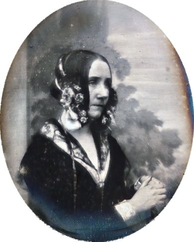

---
tags:
  [
    Augusta Ada King,
    Ada Lovelace,
    Ada (langage),
    Charles Babbage,
    Informatique,
    Programmation,
    Algorithmie,
    Analytique,
  ]
---

# Augusta Ada King, la visionnaire

_Le premier algorithme informatique a été inventé... **AVANT** l'invention des ordinateurs ! 😱_

## Explications

Le 10 décembre 1815, Anne Isabella Milbanke, épouse de Lord Byron, donne naissance à une fille, _Augusta Ada King_, comtesse de Lovelace, née Ada Byron, qui sera connue plus tard sous le nom d'**Ada Lovelace**.

Il se trouve que ce bébé est la seule fille légitime de Lord Byron, célébrissime poète britannique, ayant un certain comportement...

Les deux parents se séparèrent alors qu'Ada était encore bébé.

Anne Isabella Milbanke a peur que sa fille devienne comme son père, aussi l'obligea-t-elle à se passionner pour une matière opposée à la poésie :
LES MATHS 🔢 !!

Pourtant, bien qu'elle n'ait finalement jamais connu son célèbre père, Ada était invitée partout...

## Ses débuts

À 17 ans, Ada est invitée à une conférence donnée par le mathématicien _Charles Babbage_, qui lui montre un morceau de la machine à calculer qu'il vient de construire. Une amitié se noue et ils resteront des années en contact...

En 1835, Ada se marie, fonde une famille, étudie toujours les maths et reste en contact avec Babbage. Ils parlent de la machine à calculer imaginée par Babbage, appelée "_machine analytique_", une machine plus élaborée, et programmable avec des cartes perforées.

En 1842, Ada traduit en anglais un article paru en français sur cette fameuse machine analytique. Elle y ajoutera quelques notes (représentant près de trois fois le volume de texte de l'article original) :

:::info
Dans l'une de ses notes, Ada a l'intuition que cette machine pourrait faire autre chose que de manipuler des chiffres.

Dans une autre, elle écrit une série de boucles d'instructions qui permettent de dire à la machine : '**Répéter tant de fois une opération**'.

**_LE PREMIER ALGORITHME INFORMATIQUE ÉTAIT NÉ 🐣 !!_**
:::

## Fin de vie

Les notes sont publiées, et Ada est, sur le papier, promise à une grande carrière scientifique...

Babbage n'avait pas obtenu de financement du gouvernement britannique pour sa machine, alors Ada se mit à jouer. Elle travailla sur un système qui devait lui permettre de remporter les paris du _derby d'Epsom_ mais cela l'entraîna dans l'accumulation de dettes.

Puis, Ada meurt en 1852, d'un cancer douloureux, à l'âge de 36 ans.

## Finalement...

La machine analytique de Babbage ne verra finalement jamais le jour :

Charles Babbage est dans l'incapacité, malgré tous ses efforts, de réaliser sa machine, car les matériaux techniques de l'époque (roues dentées, leviers, tambours...) sont insuffisants.

**On peut donc conclure qu'Ada a inventé la programmation **AVANT** même l'existence des ordinateurs.**

## Postérité

_Le nom d'Ada Lovelace est redécouvert en 1979, lorsqu'on a donné son nom à un langage de programmation orientée objet..._
