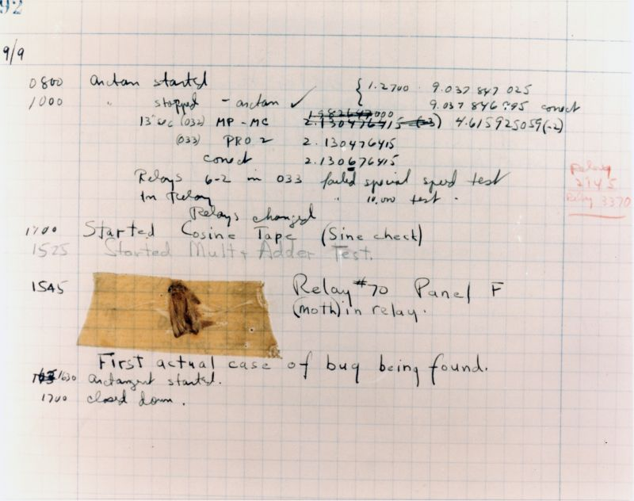

# 📜 𝗟𝗲 𝘁𝗼𝘂𝘁 𝗽𝗿𝗲𝗺𝗶𝗲𝗿 𝗯𝘂𝗴 𝗶𝗻𝗳𝗼𝗿𝗺𝗮𝘁𝗶𝗾𝘂𝗲… 𝗻’𝗮𝘃𝗮𝗶𝘁 𝗿𝗶𝗲𝗻 𝗱𝗲 𝘃𝗶𝗿𝘁𝘂𝗲𝗹 !

💾 On parle souvent de 𝗯𝘂𝗴𝘀 en développement web, mais connais-tu l’origine de ce mot ?

Son histoire remonte bien avant nos lignes de code 𝘑𝘢𝘷𝘢𝘚𝘤𝘳𝘪𝘱𝘵 ou nos animations 𝘊𝘚𝘚.

🕰️ Retour dans les 𝗮𝗻𝗻𝗲́𝗲𝘀 𝟭𝟵𝟰𝟬, au cœur d’un laboratoire de Harvard...

Les ingénieurs de l’époque manipulent une machine hors norme :
🤖 𝗟𝗲 𝗛𝗮𝗿𝘃𝗮𝗿𝗱 𝗠𝗮𝗿𝗸 𝗜𝗜, un ordinateur électromécanique de 𝟮𝟯 𝘁𝗼𝗻𝗻𝗲𝘀 occupant 𝟯𝟳𝟬 𝗺².

Ce monstre était capable de réaliser des calculs avancés comme :
🧮 𝘙𝘢𝘤𝘪𝘯𝘦𝘴 𝘤𝘢𝘳𝘳𝘦́𝘦𝘴
🧮 𝘓𝘰𝘨𝘢𝘳𝘪𝘵𝘩𝘮𝘦𝘴
🧮 𝘍𝘰𝘯𝘤𝘵𝘪𝘰𝘯𝘴 𝘵𝘳𝘪𝘨𝘰𝘯𝘰𝘮𝘦́𝘵𝘳𝘪𝘲𝘶𝘦𝘴
🧮 𝘌𝘹𝘱𝘰𝘯𝘦𝘯𝘵𝘪𝘦𝘭𝘭𝘦𝘴

Un bijou de technologie… mais aussi une machine capricieuse.

📅 𝗟𝗲 𝟵 𝘀𝗲𝗽𝘁𝗲𝗺𝗯𝗿𝗲 𝟭𝟵𝟰𝟳, les ingénieurs remarquent une panne inexpliquée.
La machine refuse de fonctionner correctement !!

🔎 En ouvrant l’appareil, la découverte est aussi improbable qu’historique :
Un 𝗽𝗮𝗽𝗶𝗹𝗹𝗼𝗻 🦋, coincé entre deux relais, perturbe le fonctionnement de l’ordinateur.

L’équipe consigne l’événement dans le journal de bord, avec une note pleine d’humour :
➡️ « 𝘍𝘪𝘳𝘴𝘵 𝘢𝘤𝘵𝘶𝘢𝘭 𝘤𝘢𝘴𝘦 𝘰𝘧 𝘣𝘶𝘨 𝘣𝘦𝘪𝘯𝘨 𝘧𝘰𝘶𝘯𝘥 ».

📖Le tout premier à utiliser le mot "𝘣𝘶𝘨", c'est 𝗧𝗵𝗼𝗺𝗮𝘀 𝗘𝗱𝗶𝘀𝗼𝗻 qui avait découvert une panne dans son phonographe et l'avait comparé un insecte imaginaire.

Mais l'incident du 𝗠𝗮𝗿𝗸 𝗜𝗜 est entré dans la légende. Il a contribué à populariser l’usage du terme dans le domaine informatique.

💡 𝗣𝗼𝘂𝗿𝗾𝘂𝗼𝗶 𝗰’𝗲𝘀𝘁 𝗶𝗻𝘁𝗲́𝗿𝗲𝘀𝘀𝗮𝗻𝘁 𝗽𝗼𝘂𝗿 𝗻𝗼𝘂𝘀, 𝗱𝗲́𝘃𝗲𝗹𝗼𝗽𝗽𝗲𝘂𝗿𝘀 𝘄𝗲𝗯 ?
Aujourd’hui, on chasse des bugs🦋 dans nos 𝗰𝗼𝗺𝗽𝗼𝘀𝗮𝗻𝘁𝘀 𝗥𝗲𝗮𝗰𝘁, nos 𝗮𝗻𝗶𝗺𝗮𝘁𝗶𝗼𝗻𝘀 𝗖𝗦𝗦, ou nos 𝗔𝗣𝗜𝘀 𝗰𝗮𝗽𝗿𝗶𝗰𝗶𝗲𝘂𝘀𝗲𝘀.

Mais à l’origine, un 𝗯𝘂𝗴 était littéralement… un insecte !

La prochaine fois que tu seras sur le point à jeter ton ordinateur par la fenêtre, parce que tu auras oublié ton import 𝘊𝘚𝘚 dans tes composants 𝘙𝘦𝘢𝘤𝘵...
𝘗𝘦𝘯𝘴𝘦 𝘢̀ 𝘤𝘦 𝘱𝘦𝘵𝘪𝘵 𝘱𝘢𝘱𝘪𝘭𝘭𝘰𝘯 𝘲𝘶𝘪 𝘢 𝘪𝘯𝘴𝘤𝘳𝘪𝘵 𝘴𝘰𝘯 𝘯𝘰𝘮 𝘥𝘢𝘯𝘴 𝘭’𝘩𝘪𝘴𝘵𝘰𝘪𝘳𝘦 𝘥𝘦 𝘭’𝘪𝘯𝘧𝘰𝘳𝘮𝘢𝘵𝘪𝘲𝘶𝘦 🐛🦋

