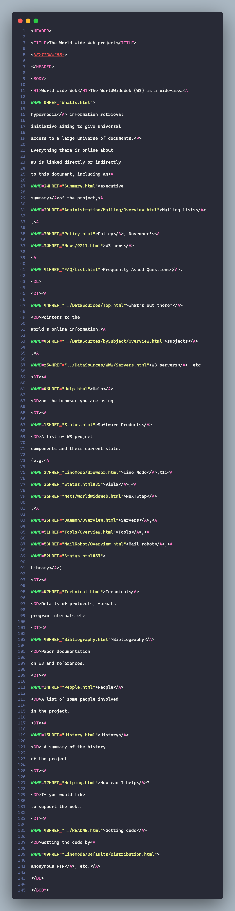

# 🌍 L'incroyable histoire du tout premier site Internet

Tu savais que **le tout premier site web de l’Histoire est encore en ligne** ?

Oui oui, c’est pas une légende ! 👀

➡️ [Découvre-le ici](https://info.cern.ch/hypertext/WWW/TheProject.html)

Mais avant de cliquer, et si on remontait un peu le temps ensemble ? 🦖  
Un petit voyage express dans l'histoire d'Internet, ça te dit ?

---

## 🧠 Aux origines du web...

### 🕰️ Les étapes clés

- **Années 1960** : l’armée US et quelques universités veulent partager des infos plus vite.
- **1969** : naissance d’**ARPANET**, le tout premier réseau de communication entre ordinateurs.
- **Début 1970** : des entreprises créent leurs propres réseaux internes.
- **1972** : première messagerie électronique ✉️
- **1983** : interconnexion des réseaux = naissance d’**Internet** (bye ARPANET 👋)

> **_C’est là que ça devient passionnant 🤓 !_**

---

## 💡 Le projet un peu fou d’un chercheur visionnaire

En **1989**, **Tim Berners-Lee**, chercheur au CERN, imagine un système pour partager des documents via un réseau mondial ouvert à tous. Résultat ? Il invente :

- ✅ Le concept de **page web**
- ✅ Le **langage HTML**
- ✅ Le **protocole HTTP**

Et bim 💥 : **le World Wide Web est né**.

Le **6 août 1991**, il publie la **toute première page web** de l’Histoire 🎉.  
Celle-là même que tu peux visiter aujourd’hui !

> Le tout est passé dans le **domaine public en 1993** — Internet, cadeau au monde 🌍.

---

## 👀 À quoi ressemblait ce premier site ?

🖥️ Une page hyper simple : pas de mise en page, pas d’images, juste du texte et des liens.  
Et pourtant, c’est cette page qui a ouvert la voie à tout ce qu’on connaît aujourd’hui :

- 🛒 Les boutiques en ligne
- 💬 Les réseaux sociaux
- 📱 Les applis web modernes

---

:::note[Conclusion]
D’un simple fichier HTML à nos plateformes de streaming, jeux en ligne et messageries instantanées…  
Le Web a littéralement **changé le monde**.

Aujourd’hui, Internet est partout : pour apprendre, rire, débattre, créer, aimer…  
Bref, **on ne peut plus s’en passer** 💡
:::

---

## 🔍 Le code du premier site

---

## ⚙️ Ce qui a changé depuis...

### 🔠 Majuscules vs minuscules

À l’époque, tout était écrit en **MAJUSCULES**.  
Aujourd’hui, HTML5 autorise les minuscules, et on a pris l’habitude de les utiliser.

### ❌ Pas de `<html>`, pas de doctype

Aucune déclaration structurante comme on les connaît aujourd’hui. Juste du contenu brut, à l’état pur.

### 🧩 La balise `<HEADER>`

Ancêtre du `<head>`, elle désignait autrefois l’en-tête… mais son sens a changé en HTML5.

### 🚪 Balises ouvertes non fermées

Ex : `
` utilisée comme un simple saut de ligne (` `).  
Plein de balises comme `<dt>` et `<dd>` étaient laissées ouvertes, sans souci.

### ⚓ Ancres HTML à l’ancienne

Les ancres étaient définies avec `name` (pas `id`) et sans guillemets !  
➡️ Exemple :  
`http://www.w3.org/.../TheProject.html#49`

### 🆔 La mystérieuse balise `<NEXTID>`

Une balise disparue aujourd’hui.  
Elle servait à **mémoriser le prochain identifiant à utiliser pour les ancres HTML**.

> Objectif : éviter les conflits et liens cassés. Plutôt malin !

---

🧭 **En résumé** : ce premier site est un **véritable fossile numérique**, une trace de l’aube d’un monde connecté.

Et maintenant que tu sais tout ça…  
Tu peux cliquer ici sans culpabilité 😉 :  
👉 [https://info.cern.ch/hypertext/WWW/TheProject.html](https://info.cern.ch/hypertext/WWW/TheProject.html)
