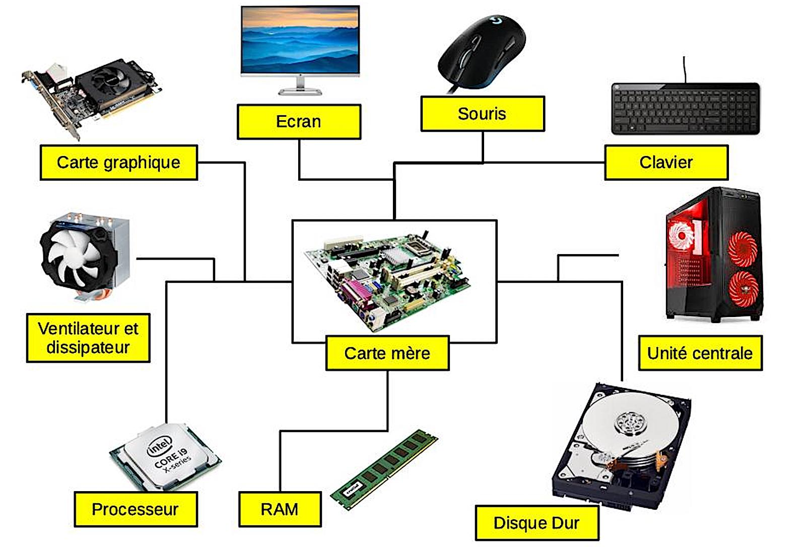

# Comment fonctionne un PC ?

Un ordinateur est une machine complexe composée de plusieurs éléments matériels et logiciels qui interagissent pour exécuter des tâches.

## 1. Les Composants Mécaniques d'un Ordinateur

Un ordinateur est composé de plusieurs pièces mécaniques essentielles. Chacune de ces pièces joue un rôle crucial dans le fonctionnement global du système. Voici les principales :

### 1.1. Carte Mère (Motherboard)

La carte mère est la colonne vertébrale de l'ordinateur. C'est un grand circuit imprimé qui connecte tous les autres composants entre eux, permettant la communication entre eux. Elle contient :

- **Sockets** pour le CPU, la RAM, et parfois le GPU.
- **Connecteurs** pour les disques durs, SSD, et autres périphériques.
- **Bus** pour la transmission des données entre les composants.

### 1.2. Unité Centrale de Traitement (CPU)

Le CPU (Central Processing Unit) est le cerveau de l'ordinateur. Il exécute les instructions des programmes en effectuant des calculs et en prenant des décisions. Un CPU est constitué de plusieurs **cœurs** (cores), chacun pouvant traiter des instructions indépendamment.

### 1.3. Unité de Traitement Graphique (GPU)

Le GPU (Graphics Processing Unit) est spécialisé dans le traitement des graphismes. Il est utilisé pour les tâches de rendu d'images, de vidéos, et de jeux vidéo, mais il est aussi de plus en plus utilisé pour des calculs massivement parallèles comme le deep learning.

### 1.4. Unité de Traitement Quantique (QPU)

Le QPU (Quantum Processing Unit) est un processeur qui utilise les principes de la mécanique quantique pour effectuer des calculs. Bien que cette technologie soit encore en développement, elle promet de révolutionner certains domaines comme la cryptographie ou l'optimisation.

### 1.5. Disque Dur et SSD

Ces composants sont utilisés pour le stockage permanent des données :

- **Disque Dur (HDD)** : Utilise des plateaux magnétiques pour stocker les données. Moins cher, mais plus lent que le SSD.
- **SSD (Solid State Drive)** : Utilise de la mémoire flash pour stocker les données. Plus rapide et plus durable que le HDD, mais plus cher.

### 1.6. Mémoire Vive (RAM)

La RAM (Random Access Memory) est une mémoire volatile utilisée par le CPU pour stocker temporairement les données pendant le traitement. La RAM est plus rapide que le stockage permanent, mais perd ses données à l'extinction du PC.

#### Différentes Layers de RAM

- **L1 Cache** : Très rapide, mais petite capacité. Intégrée dans le CPU.
- **L2 Cache** : Plus grande que L1, un peu plus lente.
- **L3 Cache** : Plus grande que L2, généralement partagée entre tous les cœurs du CPU.
- **DRAM** : La mémoire principale, beaucoup plus grande mais plus lente que les caches.

### 1.7. Bus

Le bus est un système de communication qui transfère les données entre les composants. Il existe différents types de bus pour différentes fonctions, comme le **bus système** pour les communications entre le CPU et la RAM, ou le **bus PCIe** pour les cartes graphiques.

---

## 2. L'Aspect Data et le Traitement des Instructions

### 2.1. Comment le CPU Traite les Demandes

Lorsque tu exécutes un programme, voici ce qui se passe :

1. **Lecture des Instructions** : Le CPU récupère les instructions du programme depuis la RAM.
2. **Décodage** : Le CPU décode ces instructions en opérations qu'il peut comprendre.
3. **Exécution** : Le CPU exécute ces opérations, en effectuant des calculs ou en déplaçant des données.
4. **Stockage des Résultats** : Les résultats sont temporairement stockés dans la RAM ou dans les caches pour un accès rapide.

### 2.2. Compilations et Bytecode

- **Compilation** : Lorsqu'un programme est écrit dans un langage de programmation, il doit être traduit en un langage machine que le CPU peut comprendre. Cette traduction peut se faire de manière anticipée (compilation) ou à la volée (just-in-time, JIT).
- **Bytecode** : Certains langages, comme Java, sont compilés en bytecode, une forme intermédiaire que des machines virtuelles peuvent exécuter sur différentes plateformes.

---

## 3. Stockage Physique des Données

### 3.1. Disque Dur (HDD)

Les disques durs stockent les données sur des plateaux magnétiques. Une tête de lecture/écriture se déplace sur les plateaux pour lire ou écrire des données. Les données sont organisées en secteurs et en pistes, et la vitesse de rotation des plateaux affecte les performances.

### 3.2. Disque SSD

Les SSD utilisent des cellules de mémoire flash pour stocker les données. Ils sont plus rapides que les HDD car ils n'ont pas de pièces mobiles. Les données sont stockées dans des blocs, et la gestion de la durée de vie des cellules de mémoire est un défi important pour les SSD.

---

## 4. Montage et Customisation d'un PC

### 4.1. Montage d'un PC

Monter un PC consiste à assembler les différents composants dans un boîtier. Voici les étapes générales :

1. **Installation du CPU** sur la carte mère.
2. **Installation de la RAM** dans les emplacements dédiés.
3. **Montage du GPU** dans le slot PCIe.
4. **Connexion des disques** (HDD/SSD) à la carte mère.
5. **Branchement de l'alimentation** aux différents composants.
6. **Montage du refroidissement** (ventilateurs, dissipateurs thermiques, ou refroidissement liquide).
7. **Installation du système d'exploitation**.

### 4.2. Customisation (Flux d'Air, Fréquence, Compatibilité)

- **Flux d'air** : Assurer un bon flux d'air est crucial pour le refroidissement. Dispose les ventilateurs de manière à maximiser l’entrée d’air frais et l’évacuation de l’air chaud.
- **Fréquence** : La fréquence du CPU et de la RAM peut être ajustée (overclocking) pour améliorer les performances, mais cela augmente la chaleur générée.
- **Compatibilité** : Vérifie la compatibilité des composants (CPU, RAM, GPU, etc.) avant l’achat pour éviter les incompatibilités.

---

## 5. Systèmes d'Exploitation (OS) et leur Fonctionnement

### 5.1. Différences d'OS

Les principaux systèmes d'exploitation sont **Windows**, **macOS**, et **Linux**. Chaque OS a ses particularités :

- **Windows** : Large compatibilité matérielle et logicielle, mais souvent cible des logiciels malveillants.
- **macOS** : Optimisé pour le matériel Apple, interface utilisateur soignée, mais moins de personnalisation possible.
- **Linux** : Open-source, très personnalisable, utilisé pour les serveurs et les environnements de développement.

### 5.2. Fonctionnement d'un OS

Un système d'exploitation est le logiciel qui gère le matériel de l'ordinateur et fournit des services aux programmes. Il gère :

- **Les processus** : Gère l’exécution des programmes.
- **La mémoire** : Alloue de la RAM aux programmes et assure la sécurité de l’accès à la mémoire.
- **Le stockage** : Gère les fichiers et le stockage permanent des données.
- **Les périphériques** : Gère l'interaction avec les périphériques externes (clavier, souris, imprimante, etc.).

---

En suivant ce cours, tu devrais maintenant avoir une bonne compréhension des composants d'un PC, du traitement des données par le CPU, des méthodes de stockage, des étapes de montage, et du rôle des systèmes d'exploitation. N'hésite pas à explorer davantage chaque sujet pour approfondir tes connaissances.

