# PaleoData : Son histoire

## Introduction

> 🧒Je te présente 𝓗𝓾𝓰𝓸. Il a 5 ans, et c'est un petit bonhomme génial🧒

Hugo est autiste🧠. Cela ne l'empêche pas d'avoir un intérêt particulier pour... 𝑳𝑬𝑺 𝑫𝑰𝑵𝑶𝑺𝑨𝑼𝑹𝑬𝑺🦕

Et tu sais quoi ?

Malgré son tout jeune âge, il a été récemment un sérieux moteur pour moi🙏!

J'adore la paléontologie, aussi. Depuis bambino... Je crois que c'est un domaine qui a fasciné, et qui fascine encore, des millions d'enfants👁.

Et comme toutes les sciences, c'est un domaine dont on ne finira jamais de découvrir et d'approfondir tous les secrets de ces trésors qui reposent sous nos pieds💎.

Alors, voilà : Il y a quelques mois, me trottait au fin fond de mon esprit, un projet web sur les monstres du passé, et l'univers de la paléontologie en général...

Grâce à Hugo, cette source de motivation, je me suis lancé dans un projet web ayant pour but de joindre l'utile à l'agréable...

---

Ce projet c'est **_PaleoData_** !

➡️ [https://chrstn67.github.io/PaleoData/#](https://chrstn67.github.io/PaleoData/#)

L'objectif est d'y centraliser toutes les informations possibles et imaginables sur les monstres du passé, la paléontologie en général, les paléontologues qui ont marqué l'Histoire, l'échelle des temps, etc...

On parle souvent des dinosaures, mais très souvent, on a tendance à oublier qu'**_avant et après_** les dinos, d'autres bestioles étranges ont peut-être foulé le sol sur lequel repose ta maison... Alors j'ai eu envie de répertorier tous ces animaux dans un seul site !

Toujours est-il qu'il s'agit d'un travail titanesque. Et puis c'est un sujet scientifique : On découvre, on met à jour des centaines d'informations par jour... C'est impossible de TOUT savoir sur ce sujet. Donc je te présente un site qui ne sera, dans un sens, jamais terminé 😉.

Tu veux connaitre quelques coulisses de ce projet ? Comment je l'ai réalisé ? Alors, remontons le temps ensemble que je te fasse visiter 🤝 !

Je vais te montrer des images de la _Version 1_, sans m'attarder sur les codes, et je les comparerai avec la _Version 2_ où je te montrerai 2-3 trucs intéressants😋
Je généralise aussi : Je te montre le rendu seulement en version desktop (ordinateur). En mobile, tout est pratiquement placé en colonne.

> Autre précision avant de poursuivre : Ce projet est _100% frontend_, toutes les infos du site sont tapées à la main... Je n'utilise ni backend, ni API, ni base de données... Ne m'en veux pas, c'est un choix voulu et assumé. Merci de le respecter 😊

---

---

## L'idée du projet

J'ai eu l'idée de ce projet durant ma formation en développement web. La toute première ébauche n'était ni plus ni moins, qu'un immense tableau... Je te laisse imaginer la galère :

- Un tableau avec plusieurs colonnes correspondant à l'échelle des temps géologiques, et une colonne avec la liste de quelques animaux... Du code HTML et JS absolument pas optimisé, pas de Frameworks, pas de boucles, pas de rangement, RIEN !

- D'autant plus que lorsque tu crées un site, il se doit d'être _responsive_, adapté à tous types d'écrans ! Un tableau de cette taille _responsive_ ? Oublie 😵😵💫🫥 !

J'avais donc laissé le projet de côté, en attendant d'acquérir d'autres compétences, particulièrement en **React**.

Ce temps de "repos" m'a permis de réfléchir un peu plus précisément à ce que je souhaitais voir apparaitre sur **_PaleoData_** :

- Une page d'accueil
- Une page avec la liste des animaux
- Une "carte d'identité" de chaque animal
- L'échelle des temps géologiques
- La liste des étymologies (car les animaux ont des noms qui trouvent leurs origines dans les langues anciennes)
- Une page de documentation

> Là, j'ai commis une erreur (de p'tit nouveau) qui se répercutera très nettement plus tard🤨🧐...

Ayant compris les concepts de **React**, je m'attaque enfin au projet à proprement parler ! 🥳

---

## Version 1

### NavBar

La première version de la barre de navigation se trouve dans un précédent article :

➡️ [React : Comment réaliser un menu-burger fonctionnel](https://www.linkedin.com/pulse/react-comment-r%2525C3%2525A9aliser-un-menu-burger-fonctionnel-christian-humbert-zoalc/?trackingId=hYk%2B1NKQQdWVzAJ59K8h5w%3D%3D)

### Page d'accueil

La première version de la page d'accueil était celle-ci :

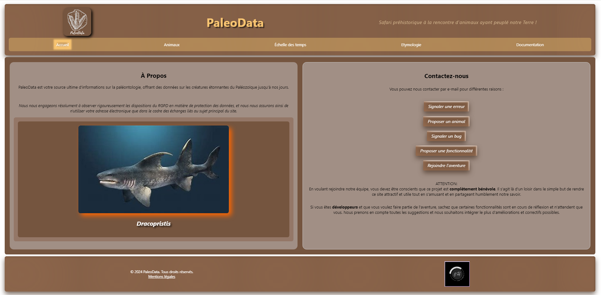

Bon, tu en conviendras, les couleurs sont ternes. C'était voulu, pour coller avec le côté sableux, terreux, fossiles...

Donc, une HomePage en deux parties, celle de gauche avec un rappel à la **loi RGPD**, et une image aléatoire d'un des animaux présent sur le site.

Sur la partie droite, une liste de boutons revoyant à l'adresse mail de PaleoData, en fonction de la demande : J'avais programmé pour qu'il y ait une trame de la demande dans le mail, en fonction du bouton sur lequel on clique.

En _format-mobile_, tout était placé en colonne.

Un peu rébarbatif, on ne sait pas trop ce qu'on peut trouver sur le site...

J'y ai fini par y trouver une sorte de lassitude, un côté trop old-school... Cela ne me correspondait pas franchement...

---

---

> **_NB_** : Le RGPD est un règlement européen entré en vigueur le 25 mai 2018 qui vise à renforcer la protection des données personnelles des citoyens de l'Union européenne. Ses principaux objectifs sont : 1) Protéger la vie privée des citoyens européens en encadrant de manière plus stricte la collecte et l'utilisation de leurs données personnelles. 2) Responsabiliser les organismes publics et privés qui traitent ces données et les sanctionner en cas de manquement. 3) Répondre à une demande citoyenne de plus de transparence et de contrôle sur l'utilisation de leurs données. 4) Protéger les personnes vulnérables.

> La loi RGPD s'applique à tout organisme, quelle que soit sa taille ou son activité, qui collecte ou traite des données personnelles de citoyens européens, que l'entreprise soit établie en Europe ou non. Il accorde de nouveaux droits aux individus, comme le droit d'accès, de rectification, d'effacement, de portabilité de leurs données, ainsi que le droit d'être informé en cas de violation. À l'inverse, le RGPD interdit la collecte de certaines catégories de données dites "sensibles" comme les opinions politiques ou l'orientation sexuelle. Les organismes doivent être en mesure de prouver à tout moment leur conformité au RGPD, notamment en tenant un registre des activités de traitement.. Des sanctions financières lourdes peuvent être appliquées en cas de non-respect.

---

---

### Les filtres des animaux

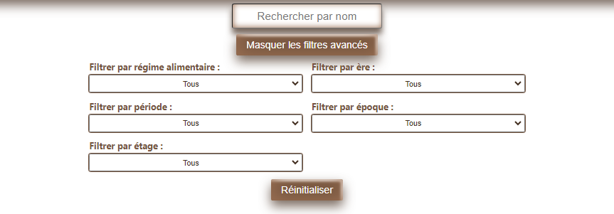

Permettant d'afficher les animaux en fonction de ce que l'on recherche, c'est peut-être le composant qui a le moins changé, car il n'y aura qu'une seule petite modification dans la V2.

En _format-mobile_, les options de filtres étaient (et sont toujours) en colonne.

### Liste des animaux

J'ai toujours voulu la liste des animaux sous forme de cartes prenant tout l'espace d'écran disponible.

En format-mobile, les cartes sont placées en colonne.

Dans la V1, je trouvais que cela manquait de modernité, de clarté... de vie. Les images n'étaient pas mises en valeur...

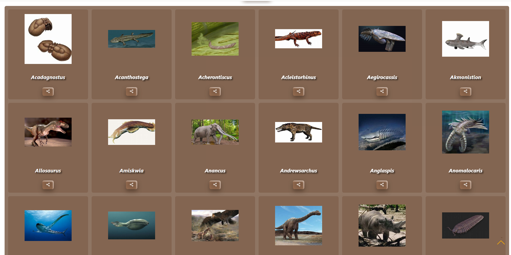

### La carte d'identité de l'animal sélectionné

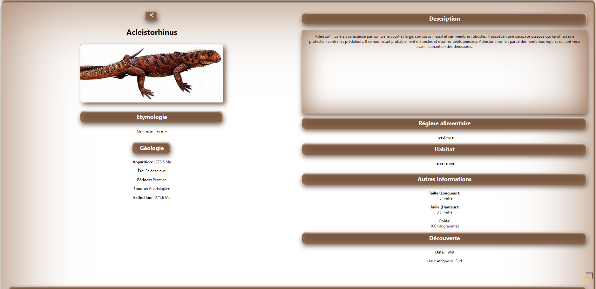

Le code couleur était toujours présent, mais je trouvais qu'il y avait un décalage des éléments entre les deux parties (gauche et droite) de l'écran. Et d'une manière générale, la place n'était pas du tout optimisée : trop de perte...

Les infos y étaient, mais je trouvais que ce composant manquait aussi un peu de vie : le nom de l'animal n'était pas mis en valeur, les informations géologiques ternes (j'aurais voulu les animer un peu plus)...

En _format-mobile_, tout était placé en colonne, donc la perte d'espace n'était pas visible.

Quant aux mentions, "_Taille (Longueur)_" et "_Taille (hauteur)_"... Trop verbeux...

Dans ce composant, il y aussi la taxonomie de l'animal. Je l'ai fait sous forme de tableau, et comme il n'y a que deux colonnes, ce n'est pas compliqué de le gérer en _responsive_, où les lignes sont disposées en une seule colonne.

Dans la V2, rien n'a changé :

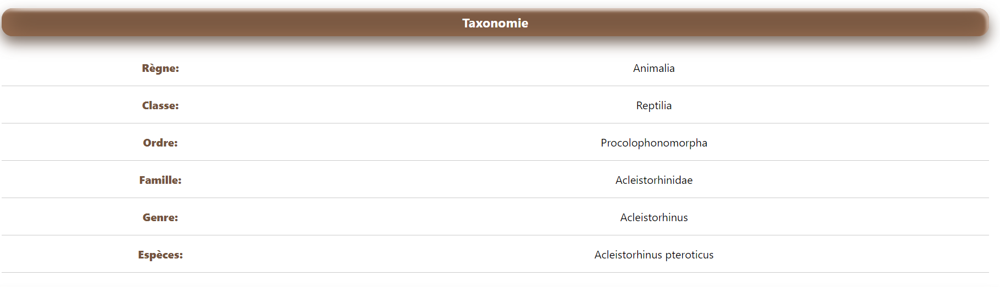

### L'échelle des temps (Timeline)

Il faut savoir qu'en géologie, les spécialistes divisent le temps en **_ères_** (qui sont des divisions des **_éons_**, mais restons simples). Ces **_ères_** sont divisées en **_périodes_**. Ces **_périodes_** sont divisées en **_époques_**, qui sont elles-même divisées en **_étages_**... (Ça va😜?)

Par exemple, si tu parles des dinosaures du **Jurassique**, tu parles d'une _période_ et non d'une _ère_, comme on l'entend dans certains documentaires, ou certains films.

Bref, dans **PaleoData**, il faut que tu t'imagines une ligne du temps mise dans des boîtes... Et je voulais garder cette façon de penser...

Donc, quand tu cliques sur une **_ère_**, s'afficheront les **_périodes_**. Si tu cliques sur les périodes, s'afficheront les **_époques_**. Et si tu cliques sur les **_époques_**, s'afficheront les **_étages_**... Et à chaque fois, tu auras un bouton d'ℹnformation sur l'élément ciblé.

Un peu fastidieux, mais bon... Cela me convient...

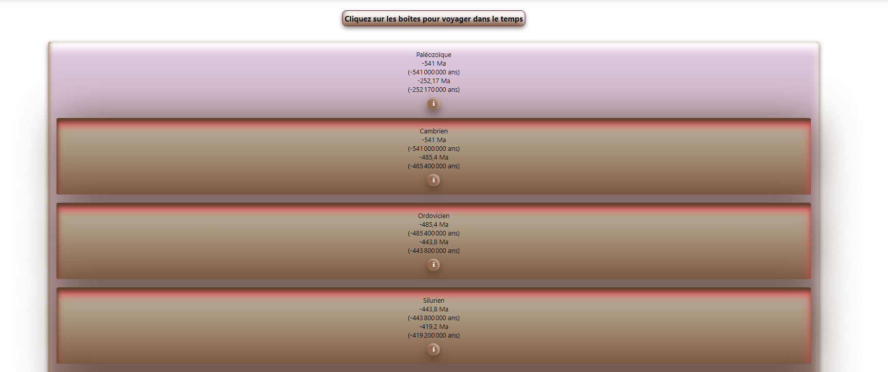

Le problème de cette timeline, ce sont les couleurs... Je t'explique pourquoi plus tard⏰.

### Les modales d'informations des éléments de la frise

Rien de particulier : Elles n'ont pas changées. À ceci près que j'avais fait une petite erreur de sémantique : quand on code une modale en HTML, on utilise la balise `<dialog>`...

Au click sur l'icône ℹ️, une modale s'affiche pour livrer des informations sur l'élément qui t'intéresse.

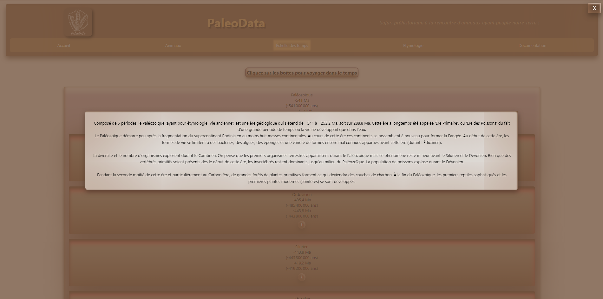

### Étymologie

Les noms des êtres vivants tiennent bien souvent leur racines dans les langues anciennes (principalement des racines grecques et latines). Les montres du passé ne font pas exception.

Donc plutôt que de devoir chercher un animal (qui n'est peut-être même pas encore inclus dans le site) pour trouver l'étymologie de son nom, j'ai préféré faire une page pour cela.

Une bête tableau (encore...)

En _format-mobile_, j'ai juste réduit la taille des colonnes... Mais identiquement aux autres composant, je trouve que cela manquait de vie, un côté ludique...

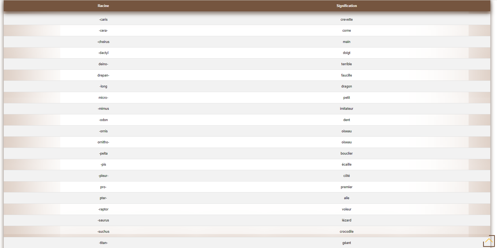

### Documentation

Rien que des _summary_ et des _details_...

En gros, tu cliques sur une ligne (_summary_), cela te déroule des infos (_details_).

J'avais rangé les informations par catégories (triées de manière alphabétique) dans lesquelles apparaissent les notions (aussi triées alphabétiquement)...

Quand il n'y a pas beaucoup d'informations, cela peut être une bonne idée. Mais quand il y en a beaucoup, cela peut devenir vite compliqué et décourageant pour l'utilisateur.

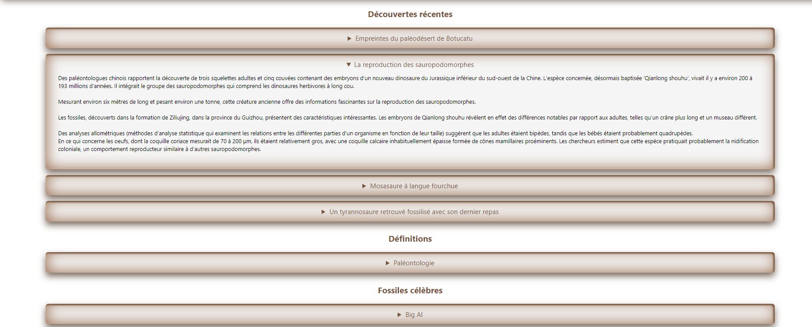

> **OK ! Jusque-là, est-ce que tu arrives à t'imaginer cette premier version de mon PaleoData😄 ? Qu'est-ce que tu en penses ?**

Je vais maintenant reprendre composant par composant, et te montrer le rendu final avec des p'tits extraits de codes intéressants qui peuvent t'être utiles dans tes projets.

Chaud 💪 ?

---

## Version 2

Ah, au fait : Je t'avais dit plus haut que j'avais commis une erreur, lorsque j'avais planché ce que je voulais... La trame avec les idées des pages était là, ce n'était pas le soucis.

Mais j'ai oublié de faire quelque chose de **CA-PI-TA-LE** : un **_cahier des charges_**... J'ai commencé à coder tête baissée... Je n'avais que l'idée du composant, mais je ne réfléchissait pas au design, aux couleurs ou encore à la disposition des éléments...

C'est un peu pour cela que j'ai dû travailler sur une refonte (surtout visuelle) du site...

Commençons...

### NavBar

En format _desktop_, la barre de navigation n'a pas changé, si ce n'est quelques retouches visuelles.

Le gros de changement de composant est en _format-mobile_ : la NavBar se trouve à présent... **_en bas_**.

(Dans l'article que je t'évoquais plus haut concernant le menu-burger, en format-mobile, ce menu se situait... **_en haut_**...)

> C'est une question d' "_expérience utilisateur_" : Si tu prends ton téléphone d'une seule main, tu auras du mal à accéder au menu si il se situe en haut. Alors qu'en bas, ce sera nettement plus facile de cliquer sur les icônes ou onglets qui t'intéressent... Cette manière de faire commence à se démocratiser : Si tu utilises LinkedIn ou WhatsApp, tu as dû le constater récemment... Consulte ce site, si tu veux plus de renseignements à ce sujet : https://www.olybop.fr/dossier-ux-mobile-navigation-bottom/

Donc, de mon côté, je me suis arrangé pour que ma NavBar soit placée **_en bas_**.

J'ai donc mis des icônes et placé le texte en plus petit en-dessous (les icônes apparaissent aussi en _desktop_) :

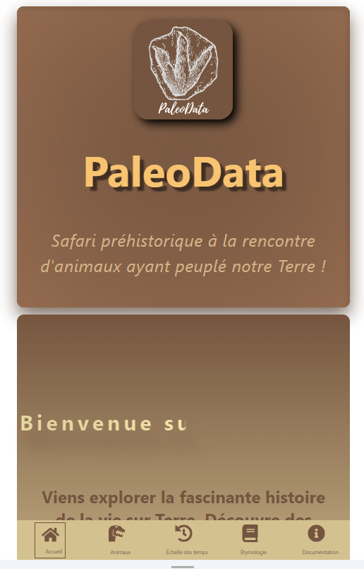

Extrait de code SCSS :

```scss
.navbar {
  //...

  @media screen and (max-width: 768px) {
    border-radius: 0.5em;
    position: fixed;
    bottom: 0;
    left: 0;
    width: 100%;
    z-index: 10;
    padding: 0 1.5em;
    box-sizing: border-box;
    background-color: transparent;
  }

  //...
}
```

Ainsi, dès que l'écran est inférieur ou égal à 768 pixels, la barre de navigation se place en bas, et fixée au bas de l'écran (**_position: fixed; bottom: 0;_**). Les autres propriétés permettent le placement au centre de l'écran, et de prendre l'espace qu'on laisse à cette NavBar.

Pour le placement du texte sous l'icône... À toi de jouer😉!

### Page d'accueil

Je t'avoue que la page d'accueil ne m'inspirait pas... Je cherchais trop compliqué...

Donc, je me suis dit que la simplicité devait régler le soucis...

Pourquoi pas cette version ?

Des encadrés avec menant vers les pages du site, et puis surtout, un bandeau avec un mot de bienvenue animé. Un petit changement de couleur, pour que ce soit plus clair, mais toujours en gardant un côté "fossile"...

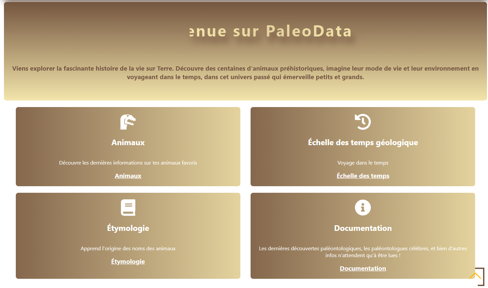

### Les filtres des animaux

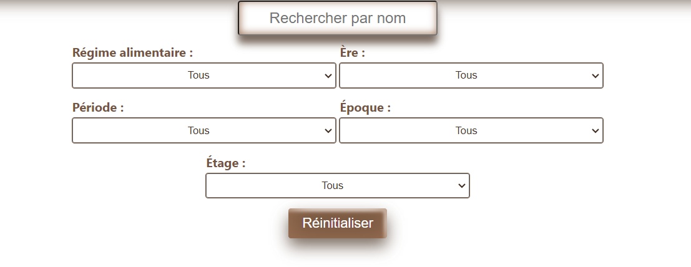

Bon, là, je t'avais prévenu, pas de gros changements, si ce n'est que j'ai supprimé le choix d'afficher ou non les filtres. J'y ai mis un espacement différent, mais à part ça...

### La carte d'identité de l'animal sélectionné

💛Ma partie préférée💛

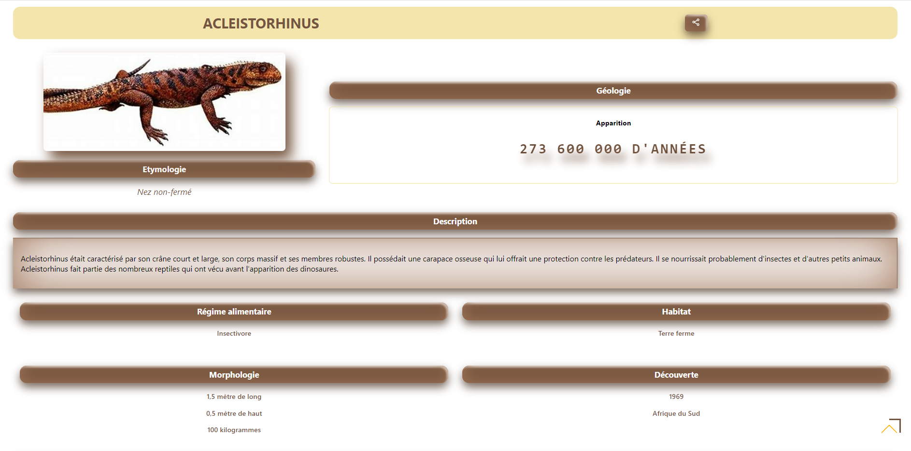

D'abord, il faut comprendre que les informations des animaux sont placées dans un fichier placé à part dans le projet.

Pour un animal, cela ressemble à cela :

```jsx
{
    nom: 'Acleistorhinus',
    etymologie: 'Nez non-fermé',
    image_url: './assets/images/Acleistorhinus.jpg',
    taxonomie: {
      règne: 'Animalia',
      classe: 'Reptilia',
      ordre: 'Procolophonomorpha',
      famille: 'Acleistorhinidae',
      genre: 'Acleistorhinus',
      espèces: 'Acleistorhinus pteroticus',
    },
    regime_alimentaire: 'Insectivore',
    habitat: 'Terre ferme',
    geologie: {
      ere: 'Paléozoïque',
      periode: 'Permien',
      epoque: 'Guadalupien',
      stage: 'Roadien',
      apparition: -273.6,
      extinction: -271.6,
    },
    description:
      "Acleistorhinus était caractérisé par son crâne court et large, son corps massif et ses membres robustes. Il possédait une carapace osseuse qui lui offrait une protection contre les prédateurs. Il se nourrissait probablement d'insectes et d'autres petits animaux. Acleistorhinus fait partie des nombreux reptiles qui ont vécu avant l'apparition des dinosaures.",
    autres_infos: {
      taille: {
        longueur: '1,5 mètre',
        hauteur: '0,5 mètre',
      },
      poids: '100 kilogrammes',
    },
    decouverte: {
      date: '1969',
      lieu: 'Afrique du Sud',
    },
  },
```

On ne dirait pas comme cela, mais les données sont rangées... dans un tableau 🫨... que l'on appelle un **_tableau de données_** ou **_tableau d'objet_**.

Je t'explique simplement, sans trop entrer dans le détail :

Dans mon projet, je vais relier toooout ce fichier avec tooooutes les informations de toooous les animaux. Ensuite, je vais les '_boucler_' de manière à avoir les informations que je souhaite afficher concernant un animal, dans un composant que j'avais appelé **_AnimalCard_** (Ça va😜?).

Poursuivons, ça ira mieux 😛

Bien que la partie de la taxonomie n'ait pas changée (non-visible sur l'image), je suis très content de cette mouture :

- L'image et l'étymologie sont placées en haut à gauche.

- La description est placée sur la longueur de la page, parce que certains animaux ont une description plus longue que d'autres. Le fait de la placer sur la longueur "économise" de la place sur la hauteur du texte. Il y a possibilité de scroller si le texte est toutefois trop long, ce qui mieux visible sur la version mobile.

- Les informations de morphologie, d'habitat, de régime alimentaire et de découvertes sont alignées et disposées en carré, avec une meilleure lecture des infos.

Le plus intéressant est l'affichage des informations géologiques... J'en ai fait un composant **_GeoInfo_** que j'ai trouvé très intéressant à faire.
Plutôt que de disposer les données dans des colonnes insipides, j'ai voulu faire un affichage alternatif.

Toutes les 5 secondes, s'affichent respectivement les infos géologiques de l'animal :

```jsx
geologie: {
      ere: 'Paléozoïque',
      periode: 'Permien',
      epoque: 'Guadalupien',
      stage: 'Roadien',
      apparition: -273.6,
      extinction: -271.6,
    },
```

Dans cet extrait du **_tableau de données_**, on constate une petite chose... Les données de l'ère, de la période, de l'époque et de l'étage sont placés entre guillemets (simples ou doubles, cela ne change rien ici).

Mais les données d'apparition et de disparition sont inscrites sans guillemets...

Pourquoi 🤔 ?

Ce qui est entre guillemets, ce sont des **_strings_**, c'est-à-dire des **_chaines de caractères_**. Sans guillemets, ce sont des **_integer_**, des **_nombres_**. Inscrire les nombres de cette manière est plus pratique pour la suite...

Tu remarques que lorsqu'on parle de géologie, de dinosaures etc, on s'exprime en _Millions d'années_ (Ma, pour les intimes), sauf que c'est trop long d'écrire "-273600000 Ma" en **_string_**...

Donc on va simplifier, écrire -273.6 en **_integer_** et passer par une conversion dans le code :

```js
const formatMillionsYears = (number) => {
  if (number > 0) {
    return number;
  }

  const absNumber = Math.abs(number);
  const million = 1000000;

  if (absNumber >= 1) {
    const formattedNumber = absNumber * million;
    const numberString = formattedNumber.toString();
    const lastIndex = numberString.length - 6;
    const formattedString = `${numberString.slice(
      0,
      lastIndex
    )} ${numberString.slice(lastIndex, lastIndex + 3)} ${numberString.slice(
      lastIndex + 3
    )}`;
    return `${formattedString} d'années`;
  }

  const formattedNumber = absNumber * million;
  const formattedString = Math.floor(formattedNumber).toString();
  const lastIndex = formattedString.length - 3;
  const finalFormattedString = `${formattedString.slice(
    0,
    lastIndex
  )} ${formattedString.slice(lastIndex)}`;
  return `${finalFormattedString} ans`;
};
```

Dans ce code :

1. La fonction prend un nombre en paramètre. Si ce nombre est supérieur à zéro, elle le renvoie tel quel.
2. Si le nombre est inférieur ou égal à zéro, elle calcule sa valeur absolue (c'est-à-dire qu'elle le rend positif) et la stocke dans la variable _absNumber_.
3. Elle définit ensuite une variable **million** qui vaut 1,000,000.
4. Si _absNumber_ est supérieur ou égal à 1, elle multiplie _absNumber_ par **million** pour obtenir le nombre d'années, puis formatte ce nombre en ajoutant des espaces pour séparer les millions, les milliers et les unités. Le résultat est renvoyé avec la mention "d'années".
5. Si _absNumber_ est inférieur à 1, elle multiplie _absNumber_ par **million** pour obtenir le nombre d'années, puis arrondit ce nombre à l'entier inférieur et le formatte en ajoutant un espace pour séparer les milliers des unités. Le résultat est renvoyé avec la mention "ans".

Tout cela fera qu'à l'affichage on aura, non pas _-273.6_, mais bien _-273 600 000 Millions d'années_.

Autre point intéressant : _Comment faire pour afficher TOUTES les données géologiques dans l'ordre, les unes après les autres, et à l'infini ?_

1. On va créer _geoInfosArray_ et _geoInfosTypes_, deux **arrays** créés à partir de l'objet _geologie_, que l'on retrouve dans le tableau de données. On utilise la logique conditionnelle pour vérifier si certaines propriétés de _geologie_ existent, et si oui, ils ajoutent une chaîne de caractères correspondante au tableau. La méthode _filter(Boolean)_ est utilisée pour supprimer les valeurs _undefind_ ou _null_ du tableau.

2. On utilise ensuite un **Hook** (un état) de React qui stocke un index courant et une fonction pour le mettre à jour. L'index courant est initialement défini à 0, soit _const [currentIndex, setCurrentIndex] = useState(0);_.

3. _useEffect_ est un autre **Hook** de React qui est utilisé pour gérer les effets secondaires dans les composants fonctionnels. Dans notre cas, on va l'utiliser pour créer un intervalle qui met à jour _currentIndex_ toutes les 5 secondes (5000 millisecondes). L'index est incrémenté de 1 à chaque fois (on ajoute +1), et le symbole % (modulo) est utilisé pour s'assurer que l'index revient à 0 une fois qu'il a atteint la longueur de geoInfosArray.

4. La fonction _clearInterval_ est retournée dans _useEffect_ pour nettoyer l'intervalle lorsque le composant est démonté ou que _geoInfosArray_ change.

5. Enfin, le code retourne un élément JSX qui affiche le type d'information géologique correspondant à l'index courant dans le tableau _geoInfosTypes_.

Je sais, si tu débutes, je comprends que ce soit un peu flou. Mais une une fois que tu as compris comment cela fonctionne, ça ira tout seul, ne t'en fais pas😊😉.

Voici le code du composant **_GeoInfo_**, qui permet d'avoir l'affichage des données géologiques:

```jsx
import PropTypes from "prop-types";
import React, { useState, useEffect } from "react";
import "./GeoInfo.scss";

const GeoInfo = ({ geologie }) => {
  const formatMillionsYears = (number) => {
    if (number > 0) {
      return number;
    }

    const absNumber = Math.abs(number);
    const million = 1000000;

    if (absNumber >= 1) {
      const formattedNumber = absNumber * million;
      const numberString = formattedNumber.toString();
      const lastIndex = numberString.length - 6;
      const formattedString = `${numberString.slice(
        0,
        lastIndex
      )} ${numberString.slice(lastIndex, lastIndex + 3)} ${numberString.slice(
        lastIndex + 3
      )}`;
      return `${formattedString} d'années`;
    }

    const formattedNumber = absNumber * million;
    const formattedString = Math.floor(formattedNumber).toString();
    const lastIndex = formattedString.length - 3;
    const finalFormattedString = `${formattedString.slice(
      0,
      lastIndex
    )} ${formattedString.slice(lastIndex)}`;
    return `${finalFormattedString} ans`;
  };

  const geoInfoArray = [
    geologie.apparition && `${formatMillionsYears(geologie.apparition)}<br />`,
    geologie.ere && `${geologie.ere}`,
    geologie.periode && `${geologie.periode}`,
    geologie.epoque && `${geologie.epoque}`,
    geologie.stage && `${geologie.stage}`,
    geologie.extinction && `${formatMillionsYears(geologie.extinction)}<br />`,
  ].filter(Boolean);

  const geoInfoTypes = [
    geologie.apparition && "Apparition",
    geologie.ere && "Ère",
    geologie.periode && "Période",
    geologie.epoque && "Époque",
    geologie.stage && "Étage",
    geologie.extinction && "Disparition",
  ].filter(Boolean);

  const [currentIndex, setCurrentIndex] = useState(0);

  useEffect(() => {
    const intervalId = setInterval(() => {
      setCurrentIndex((prevIndex) => (prevIndex + 1) % geoInfoArray.length);
    }, 5000);

    return () => clearInterval(intervalId);
  }, [geoInfoArray]);

  return (
    <section className="animal-geologie">
      <h3>Géologie</h3>
      <div className="geo-info-container">
        <p className="geo-info-type">{geoInfoTypes[currentIndex]}</p>
        <p
          className="time-info"
          dangerouslySetInnerHTML={{ __html: geoInfoArray[currentIndex] }}
        />
      </div>
    </section>
  );
};

export default GeoInfo;
```

> **_NB_**: `import ./GeoInfo.scss;` permet de relier le code SCSS de stylisation du composant (couleurs, tailles des éléments, etc...)

Autre petite chose : La possibilité de partager un animal avec tes amis !

Je te donne le code tout prêt :

```jsx
const shareLink = async (animal) => {
  if (navigator.share) {
    try {
      await navigator.share({
        title: `Découvre des informations sur ${animal.nom}.`,
        text: `Découvre des informations sur ${animal.nom}.`,
        url: `${window.location.origin}/PaleoData/#/animal/${encodeURIComponent(
          animal.nom
        )}`,
      });
    } catch (error) {
      console.error("Erreur lors du partage :", error);
    }
  }
};
```

Ainsi, tes amis auront les infos sur l'animal que tu envoies. Cela ne les empêche de visiter le site, par la suite.

### L'échelle des temps (Timeline)

La timeline, un autre morceau. Je vais te faire grâce du code. Mais j'ai utilisé la librarie React `react-vertical-timeline-component` que j'ai ensuite stylisé à ma manière.

[react-vertical-timeline-component](https://www.npmjs.com/package/react-vertical-timeline-component)

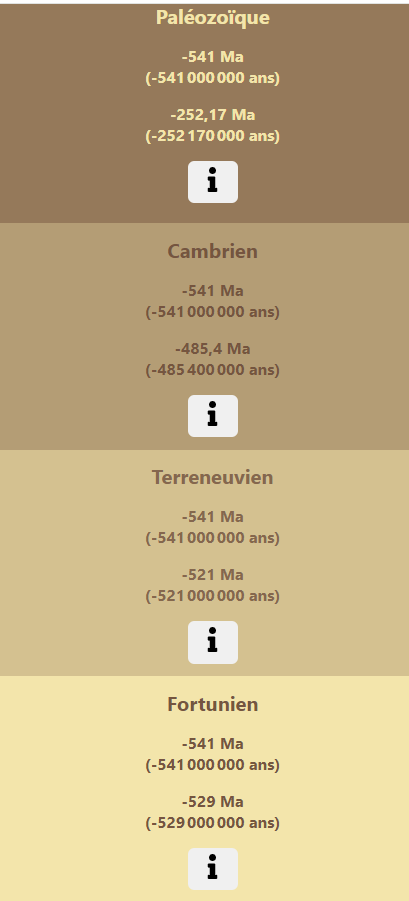

Par contre, j'attire ton attention sur les couleurs... Je ne suis pas web-designer, qui est un métier vraiment à part, mais très passionnant.

Quand on conçoit un cahier des charges, il est important de savoir que pour un site web, on ne devrait, pour ne pas dire "on doit", utiliser que 4 couleurs MAXIMUM... Il y en a plus sur mon site (9 en tout + le blanc et noir) mais l'important est d'avoir une **_identité visuelle_**. Et très clairement, sur la première version de l'échelle des temps, il n'y avait aucune identité visuelle🫣...

### Les modales d'informations des éléments de la frise

C'est bon le changement... Mais pas ici... C'est toujours la même version🙂

### Étymologie

Avoue que cela change du tableau de la première version😁!

En _format-mobile_, les "post-it" sont en colonne.

J'y ajouté la racine ayant donné le mot...

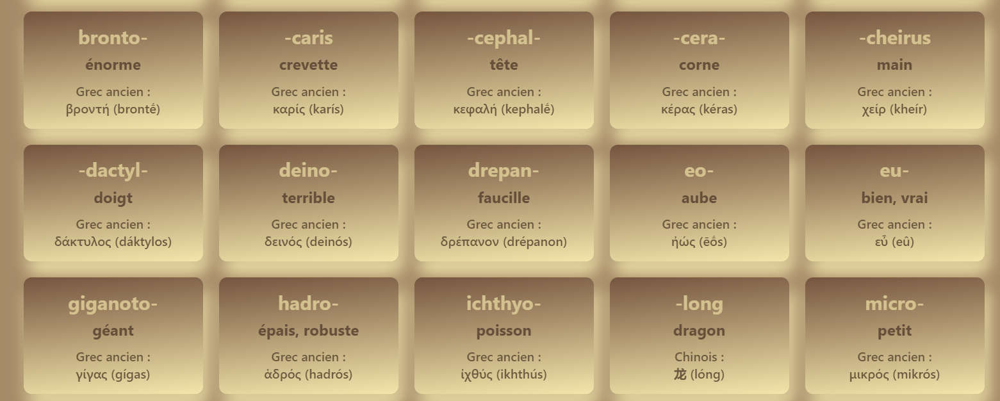

### Documentation

Alors ici, c'est drastique...

J'ai fini par opter par ce qu'on pourrait appeler une "_page d'accueil de documentation_". En fait, plutôt que d'avoir une liste interminable des informations, autant avoir chaque thème sur une page à part.

Donc, quand tu cliques sur un lien, tu auras la listes des informations du thème choisi.

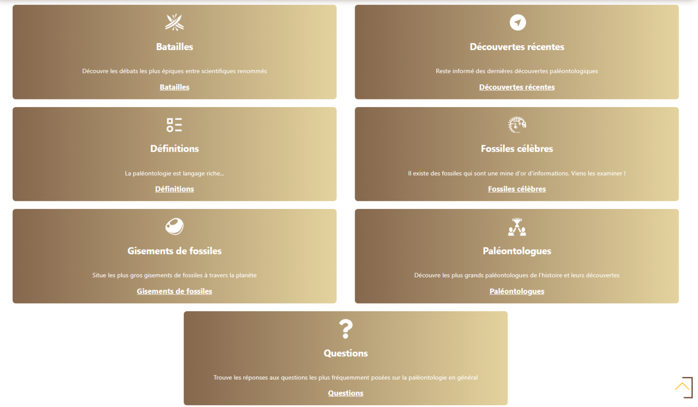

Sur les pages de chaque thème, les informations sont présentées de la même manière.

Je te montre la page **_Gisements de fossiles_** qui est plus significative :

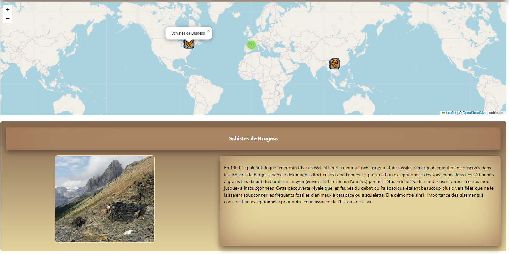

J'ai intégré une carte Leaflet.

Quand tu cliques sur une pastille correspondante à un gisement de fossiles, une explication s'affiche en dessous de la carte. À gauche, une image et à droite, une explication. Toutes les autres pages de la documentation sont basées sur le même modèle d'affichage des informations.

(Pour mieux comprendre comme fonctionne Leaflet et comment l'utiliser, rends-toi sur un article que j'ai écrit là-dessus :
[Article Leaflet](https://www.linkedin.com/pulse/tutoriel-sur-lutilisation-de-leaflet-avec-react-christian-humbert-qoyhe/?trackingId=1WH8vJuh2AzW%2FFlIf88%2FgA%3D%3D)

## Conclusion

Bon alors ? Que penses-tu de **PaleoData V2** ?

Je serais vraiment intéressé d'avoir ton retour🤗.

Tu as des idées de fonctionnalités supplémentaires ? Ou as-tu constaté un bug ou une erreur durant ta visite ?

Contacte-moi 🙂! Tu as des manière de le faire dans le footer du site😊!

En tout cas, ce projet m'a appris plusieurs choses :

- Il est important de faire un Cahier des Charges AVANT de coder
- Il est aussi important de concevoir sa charte graphique avant de ploger dans le code. En cas de refonte pour plus tard, cela facilitera grandement le travail.
- On apprend par l'erreur : J'ai réappris certaines choses et j'ai pu rendre **PaleoData** plus attrayant

N'hésite pas si tu veux en savoir plus !!!

> **NB** : Au moment où tu lis ces lignes, il es probable qu'il y ait eu quelques changements mineurs depuis, une petite retouche ça-et-là ou une modification suite à divers retours des utilisateurs 😉
