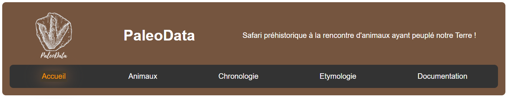
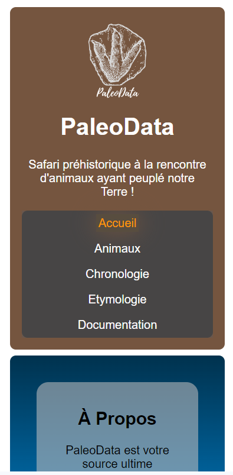
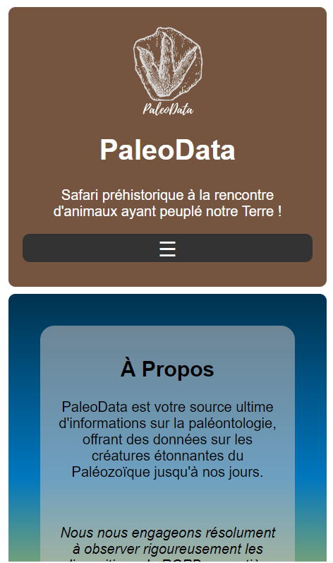
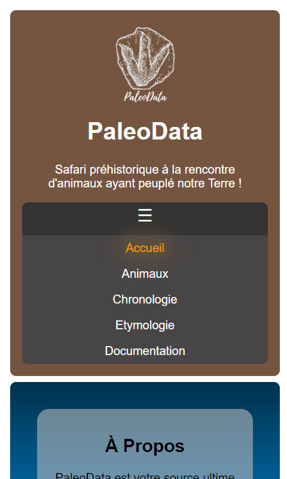
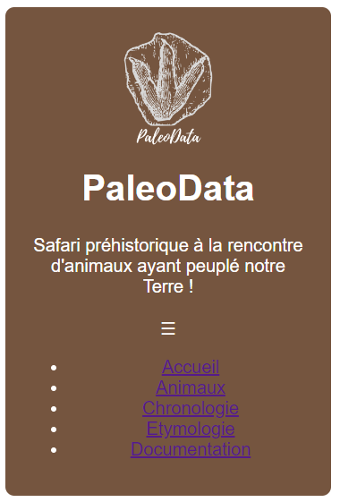

# Menu-buger

## Introduction

Bienvenue dans ce tutoriel qui te guidera dans la mise en place d'un menu-burger intégré dans un projet React, qui n'est pas forcément la fonctionnalité la plus intuitive à coder, mais rassure-toi, elle est relativement simple😉.

Pour cet article, je vais utiliser mon site [https://chrstn67.github.io/PaleoData/#/](https://chrstn67.github.io/PaleoData/#/).

Il s'agit d'un projet 100% frontend qui a pour but de donner des informations sur tous les animaux disparus. J'adore la paléontologie et c'est un sujet passionnant. Comme tous les sujets scientifiques, avec toutes les nouvelles découvertes et mises à jour, ce site ne sera pour ainsi dire, jamais terminé, du moins dans le contenu.

Je te laisse visiter 😉 !

## Prérequis

Avant de commencer, assure-toi d'avoir **Node.js** et **npm** installés sur ton PC. Tu peux les télécharger depuis [https://nodejs.org/en](https://nodejs.org/en).

Je te conseille vivement d'avoir déjà touché à React et à js. Il faut que tu sois à l'aise avec les notions de composant, d'import de composant et d'appel aux composants. Dans ce tuto, je considère que tu connais déjà tout cela.

Histoire d'avoir un code bien rangé, préfère coder un composant `NavBar.jsx`.

## Installation des dépendances

Une fois que tu as initialisé ton projet React (avec ViteJS de préférence) et que tu as une arborescence de tes dossiers fonctionnelle, n'oublie pas d'installer les dépendances nécessaires pour ton projet. Celle qui est importante quand tu fais de l'intégration :

```bash
npm install sass
```

Cette dépendance te permet de pouvoir coder en SCSS tranquillement.

Mais pour être bien sûr que toute la base soit bien importée, exécute cette commande :

```bash
npm install react react-router-dom sass
```

## Au fait, c'est quoi un menu-burger ?

Lorsque tu utilises un site web comprenant plusieurs pages, on a pour habitude de 'naviguer' entre des onglets.

En format desktop (PC), tu as en général tous tes onglets qui se suivent les uns après les autres, dans ce qu'on appelle une barre de navigation ('navbar', en anglais).

Comme ici :



Quand tu travailles du CSS (ou du SCSS), il est impératif de commencer ton code par ce qu'on appelle le _mobile-first_. C'est-à-dire que tu te dois de commencer par le rendu visuel d'un smartphone.

Tu es d'accord avec moi, un écran de smartphone est plus petit que celui d'un ordinateur... Donc, il faut que tous les éléments de ta page s'imbriquent les uns dans les autres de manière cohérente, tout en faisant attention à leur placement respectifs, la taille des caractères et plein d'autres petites subtilités...

Tout cela s'appelle le _responsive design_. Je t'invite à faire des recherches plus poussées à ce sujet. Tu comprendras vite pourquoi c'est important...

Eh bien ce raisonnement, c'est pareil avec une navbar.

Regarde :



Tu le remarques, les liens sont placés les uns au dessous des autres. Ce n'est pas vilain certes, mais tu es d'accord que cela prend de la place. Sur ce site, il n'y a pas beaucoup d'onglets, mais pour un site plus conséquent, cela peut très vite devenir compliqué à lire visuellement, et encore plus à chercher ce qui t'intéresse.

Il faut donc t'imaginer un menu-burger comme un tiroir : Pour t'y retrouver, je suis sûr que tu préfères un tiroir bien rangé, plutôt qu'un tiroir où toutes tes affaires sont en vrac 😛.

Pour rester dans l'analogie du burger : Tu préfèreras, comme moi, croquer dans le pain, le steak, les tomates, la salade et les oignons en même temps plutôt que de manger tous les ingrédients séparément... 🍔



Tu constates ici que cela prend moins de place et que c'est plus pratique pour la navigation.



Le tout est de le rendre fonctionnel...

## Rendre un menu-burger fonctionnel

### Les bases

On entre dans le vif du sujet 🤩:

D'abord, il va te falloir importer un hook de React. Tu n'as pas besoin d'installer de dépendance pour cela; c'est directement installé quand tu initialises ton projet en React.

Les hooks sont des fonctions qui aident à gérer l'état et les effets dans les composants fonctionnels de React.

Ce hook, c'est `useState` :

```js
import { useState } from "react";
```

`useState` est une fonction qui te permet de créer des variables d'état dans tes composants. Ça t'aide à stocker et suivre des infos qui peuvent changer au cours du temps. En résumé, c'est comme une mémoire pour stocker des éléments, appelés des états, qui sont amenés à changer dans ton appli React ou sur ta page 😎.

Ensuite, comme évoqué plus haut, nous sommes dans notre composant `NavBar.jsx`. Nous allons donc coder à l'intérieur de cette fonction.

```js
import { useState } from "react";

const NavBar = () => {
  // ....
};

export default NavBar;
```

On crée une variable d'état appelée `isMenuOpen` qui indique si le menu est ouvert ou fermé. Sur une page web, une navbar est initialement à "fermé". On indique donc que par défaut, l'état est `false`.

`setIsMenuOpen` est une fonction qui permet de mettre à jour la valeur de `isMenuOpen` plus tard.

Comme cela :

```js
import { useState } from "react";

const NavBar = () => {
  const [isMenuOpen, setIsMenuOpen] = useState(false);

  // ....
};

export default NavBar;
```

On va intégrer une fonction `toggleMenu` qui change l'état du menu (donc de la fonction `setIsMenuOpen`), de "ouvert" à "fermé" ou vice versa, à chaque fois qu'elle est appelée, à chaque fois que tu cliques dessus

```js
const toggleMenu = () => {
  setIsMenuOpen(!isMenuOpen);
};
```

Jusque-là, ton code ressemble à ceci :

```js
import { useState } from "react";

const NavBar = () => {
  const [isMenuOpen, setIsMenuOpen] = useState(false);

  const toggleMenu = () => {
    setIsMenuOpen(!isMenuOpen);
  };

  // ....
};

export default NavBar;
```

### Le rendu statique

Maintenant qu'on a la fonction de gestion pour le menu-burger, il va falloir donner un rendu, faire apparaître ta splendide future navbar 😋 !

Il faut d'abord que ton rendu se place ainsi dans ton code :

```js
import { useState } from 'react';

const NavBar = () => {
  const [isMenuOpen, setIsMenuOpen] = useState(false);

const toggleMenu = () => {
    setIsMenuOpen(!isMenuOpen);
  };

 return (

// Rendu

 );
};

export default NavBar;
```

Voici le code du rendu, de la structure de la barre de navigation :

```js
return (
  <nav className="navbar">
    <div className="navbar-burger">☰</div>
    <ul className="navbar-list">
      <li className="navbar-item">
        <a href="/">Accueil</a>
      </li>
      <li className="navbar-item">
        <a href="/animaux">Animaux</a>
      </li>
      <li className="navbar-item">
        <a href="/frise-chronologique">Chronologie</a>
      </li>
      <li className="navbar-item">
        <a href="/liste-etymologique">Etymologie</a>
      </li>
      <li className="navbar-item">
        <a href="/documentation">Documentation</a>
      </li>
    </ul>
  </nav>
);
```

Si tu as déjà l'œil👁, tu peux constater que l'affichage est purement statique, en code HTML dur. Le code tel qu'il est ici ne fonctionnera donc pas : en format mobile, le menu-burger est fermé et il est impossible de l'ouvrir, tandis que les liens, qui apparaissent en format PC, sont inutilisables.

On va donc dynamiser tout cela...

### Le rendu dynamique

On va commencer par jouer avec cet extrait de code. Une simple `div` portant le nom de `navbar-burger` et une icône burger.

```js
<div className="navbar-burger">☰</div>
```

C'est donc sur ce petit bouton qu'on va cibler l'ouverture et la fermeture du menu lors du click.

Rien de plus simple : il suffit d'appeler la fonction `toggleMenu` qu'on a établi tout à l'heure :

```js
<div className="navbar-burger" onClick={toggleMenu}>
  ☰
</div>
```

Maintenant, la liste des onglets.

Pour créer une liste en HTML, on utilise la balise `ul`. On va y ajouter une classe SCSS qui dépend de la valeur de `isMenuOpen` :

Si `isMenuOpen` est vrai, on ajoute la classe 'show', sinon, on laisse une string vide. C'est une manière de conditionner l'ajout d'une classe SCSS en fonction de l'état du menu.

Ça donne ceci :

```js
<ul className={`navbar-list ${isMenuOpen ? 'show' : ''}`}>
```

Pour les éléments de la liste, on utilise la balise li et on lui donne une classe SCSS 'navbar-item'. À l'intérieur, il y a un composant appelé **_NavLink_**, qui crée un lien de navigation. Il va remplacer les balises `<a>` classiques.

Ce composant doit être importé en haut du fichier :

```js
import { NavLink } from "react-router-dom";
```

Pour l'instant, ta `li` ressemble à ceci :

```js
<li className="navbar-item">
  <NavLink></NavLink>
</li>
```

Il faut lui apporter quelques changements.
D'abord, il faut que lien pointe vers la page voulue, dont tu auras déjà créé les routes dans le fichier _App.jsx_ de ton application.
Pour rappel, cela doit ressembler à cela :

```js
<Route path="/" element={<HomePage />} />
```

Ici, la route pointe vers la page d'accueil.

Donc dans ta `li`, tu auras ça :

```js
<li className="navbar-item">
  <NavLink exact to="/">
    Accueil
  </NavLink>
</li>
```

Ce code signifie que ton onglet pointe _exactement (exact)_ vers _(to)_ la page d'accueil de ton site, page que tu auras codé dans le composant _HomePage_. Entre les deux balises _NavLink_, n'oublie pas de donner un nom à ton onglet, sinon, il ne s'affichera pas 😉...

Il s'agit de faire la même chose pour les autres onglets.

À présent, on va rajouter un petit quelque chose bien pratique...

Là, dans le code actuel, si tu cliques sur un onglet, ta _navbar_ reste ouverte. Et si c'était possible de faire en sorte que si tu cliques sur un onglet, la _navbar_ puisse se fermer automatiquement...

Rien de plus simple :
Tu te souviens de la fonction _toggleMenu_ ?
Il te suffit de la rajouter :

```js
<li className="navbar-item">
  <NavLink exact to="/" onClick={toggleMenu}>
    Accueil
  </NavLink>
</li>
```

_`onClick={toggleMenu}`_ signifie qu'au click sur cet onglet, la fonction est appelée pour fermer le menu si il est ouvert.

Et grande nouvelle :
**_Tu as fini ta navbar et ton menu burger 💪👏🤩 !!_**

---

Allez, comme tu as bien travaillé, je te montre le code complet :

```js
import { useState } from "react";
import { NavLink } from "react-router-dom";

const NavBar = () => {
  const [isMenuOpen, setIsMenuOpen] = useState(false);

  const toggleMenu = () => {
    setIsMenuOpen(!isMenuOpen);
  };

  return (
    <nav className="navbar">
      <div className="navbar-burger" onClick={toggleMenu}>
        ☰
      </div>
      <ul className={`navbar-list ${isMenuOpen ? "show" : ""}`}>
        <li className="navbar-item">
          <NavLink exact to="/" onClick={toggleMenu}>
            Accueil
          </NavLink>
        </li>
        <li className="navbar-item">
          <NavLink to="/animaux" onClick={toggleMenu}>
            Animaux
          </NavLink>
        </li>
        <li className="navbar-item">
          <NavLink to="/frise-chronologique" onClick={toggleMenu}>
            Chronologie
          </NavLink>
        </li>
        <li className="navbar-item">
          <NavLink to="/liste-etymologique" onClick={toggleMenu}>
            Etymologie
          </NavLink>
        </li>
        <li className="navbar-item">
          <NavLink to="/documentation" onClick={toggleMenu}>
            Documentation
          </NavLink>
        </li>
      </ul>
    </nav>
  );
};

export default NavBar;
```



... Il manque quelque chose ...
Oui : le code SCSS😉.
N'oublie pas :

```js
import "./NavBar.scss";
```

Je te donne mon code, à toi de l'adapter comme tu as envie, selon tes goûts. Évidemment, il risque d'évoluer avec le temps, mais tu as une idée de comment rendre un _menu-burger_ stylisé et fonctionnel :

```css
.navbar {
  background-color: #333;
  border-radius: 0.5em;

  .navbar-burger {
    cursor: pointer;
    display: none;
    font-size: 1.5em;

    @media screen and (max-width: 768px) {
      display: block;
    }
  }

  .navbar-list {
    list-style: none;
    padding: 0;
    margin: 0;
    display: flex;
    flex-wrap: wrap;
    justify-content: space-around;
    align-items: center;

    @media screen and (max-width: 768px) {
      flex-direction: column;

      width: 100%;
      background-color: #5e5a5a77;
      z-index: 1;
      display: none;

      &.show {
        display: flex;
      }
    }

    li {
      position: relative;
      padding: 1rem;

      &:hover {
        display: flex;
        flex-direction: column;
      }

      a {
        color: white;
        text-decoration: none;

        &:hover {
          color: #ff9900;
        }
      }
    }

    .active {
      color: #ff9900;
      padding: 0.2em;
      background-color: #ff990018;
      box-shadow: 0 0 30px #75553f;
    }

    /* Responsive styles */
    @media screen and (max-width: 768px) {
      flex-direction: column;

      li {
        padding: 0.5rem;
        position: relative;

        a {
          padding: 0.3rem;
        }
      }
    }
  }
}
```

Ce CSS fait en sorte que :

- La barre de navigation est flexible et s'aligne correctement.
- Le bouton burger est caché en format desktop mais visible en format mobile.
- La liste des éléments du menu est cachée en format mobile et affichée en format desktop.
- Quand le menu est ouvert _(.show)_, il affiche la liste des éléments en format mobile.
- Les liens de navigation changent de couleur au survol et lorsque l'utilisateur est sur la page correspondante.

---

J'espère que j'ai pu t'aider 😉 !!

Je précise qu'il peut y avoir diverses autres manières de réaliser ce menu-burger. Mais j'ai voulu te montrer quelque chose de simple. Si tu veux allez plus loin, je t'invite à faire régulièrement de la veille, des recherches, si tu préfères 😉.

Amuse-toi bien et j'ai hâte de te partager de nouvelles astuces pour pimenter tes sites web !!
