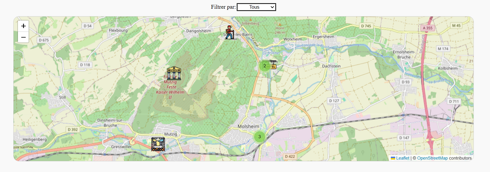
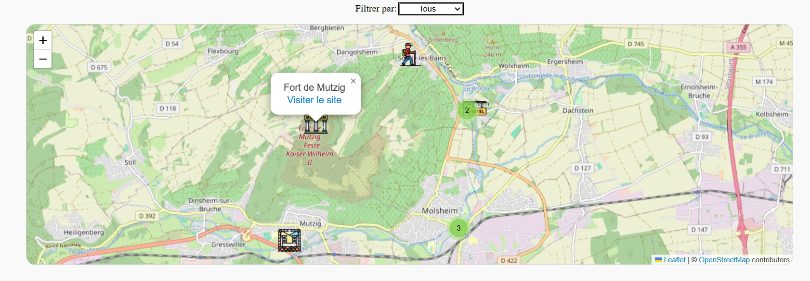

# React-leaflet

Bienvenue dans ce tutoriel qui te guidera à travers l'utilisation de Leaflet, une bibliothèque JavaScript pour créer des cartes interactives, avec React, un framework JavaScript populaire.

## Introduction

Leaflet est une bibliothèque JavaScript légère et flexible permettant de créer des cartes interactives. React, d'autre part, est un framework JavaScript développé par Facebook pour construire des interfaces utilisateur réactives.

## Prérequis

Avant de commencer, assure-toi d'avoir **Node.js** et **npm** installés sur ton PC. Tu peux les télécharger depuis [https://nodejs.org/en](https://nodejs.org/en).

## Installation des dépendances

Une fois que tu as initialisé ton projet React, installe les dépendances nécessaires pour Leaflet et d'autres packages utilisés dans cet exemple :

```bash
npm install react-leaflet leaflet react-leaflet-cluster
```

---

## Comprendre le code

Nous allons explorer le code de l'exemple fourni dans ce tutoriel.

### Imports

```jsx
import React, { useState } from "react";

import { MapContainer, TileLayer, Marker, Popup } from "react-leaflet";

import "leaflet/dist/leaflet.css";

import { Icon } from "leaflet";

import MarkerClusterGroup from "react-leaflet-cluster";

import { iconMappings, townMarker } from "./constantes";

import "./LeafletInfos.scss";
```

> **_React_** : Importe le module principal de React pour la création de composants.

> **_useState_** : Hook de React pour gérer l'état dans les composants fonctionnels.

> **_MapContainer, TileLayer, Marker, Popup_** : Composants fournis par react-leaflet pour construire la carte.

> **_Icon_** : Permet de définir des icônes personnalisées pour les marqueurs.

> **_MarkerClusterGroup_** : Composant pour regrouper les marqueurs dans des clusters.

> **_leaflet/dist/leaflet.css_** : Fournit les styles CSS pour Leaflet.

> **_iconMappings, townMarker_** : Importe des données et des constantes définies ailleurs dans le projet.

> **_LeafletInfos.scss_** : Un fichier CSS pour les styles spécifiques à cette composante (facultatif, selon les besoin de styles voulus).

---

### Fonction principale (Composant LeafletInfos, fichier LeafletInfos.jsx)

````jsx
const LeafletInfo = () => {
// ... (voir la suite dans le code)
};```

> **_LeafletInfo_** : C'est la fonction principale qui constitue le composant Leaflet dans notre application React.


### État et fonctions

```jsx
const [mapCenter, setMapCenter] = useState([48.5613977, 7.5024652]);
````

> **_mapCenter_** : Stocke les coordonnées du centre initial de la carte.

---

- **_TIPS_** :

Pour trouver les coordonnées d'un lieu, tu peux te rendre sur le site
https://nominatim.openstreetmap.org/ui/search.html

Il te suffit d'entrer une adresse ou un lieu dans la barre de recherche.

Sur la gauche, tu cherches le lieu qui correspond à ta recherche. Clique sur 'Details'. Tu auras un tableau qui s'ouvre. Cherche '_Centre Point (lat,lon)_' et copie/colle dans ton code la ribambelle de chiffres qui s'y trouve. Tu auras ainsi les coordonnées du lieu que tu veux indiquer sur ta carte Leaflet.

**ATTENTION** :

_Il peut arriver que tu ne retrouves pas un lieu. Dans ce cas, une autre solution est de te rendre sur_
https://www.google.fr/maps

_Cherche le lieu qui t'intéresse. Fait un clique-droit, puis clique-gauche sur les chiffres que tu vois en haut du tableau. Cela le copie automatiquement. Tu n'as plus qu'à le coller dans ton code._

---

```jsx
const [selectedType, setSelectedType] = useState("Tous");
```

> **_selectedType_** : Stocke le type de marqueurs à afficher sur la carte.

```jsx
const getCustomIcon = (type) => {
  return new Icon(iconMappings[type] || iconMappings.Hôtel);
};
```

> **_getCustomIcon_** : Fonction qui renvoie une icône personnalisée en fonction du type de marqueur. Elle utilise les iconMappings définis dans le fichier constantes.

---

- **_TIPS :_**

Crée dans ton composant, un fichier **constantes.jsx.** Ce fichier comporte deux parties :

1.

```jsx
export const townMarker = [
  {
    name: "Avolsheim",
    coordinates: [48.5613977, 7.5024652],
    type: "Hôtel",
    description: "Relais du Dompeter",
  },

  {
    name: "Aéroport de Strasbourg",
    coordinates: [48.538870900000006, 7.625446281168612],
    type: "Aéroport",
    description: "https://www.strasbourg.aeroport.fr/",
  },

  // etc
];
```

Tu y renseignes :

- le nom de la ville,
- les coordonnées de l'adresse,
- le type qui correspond à ce qui se trouvera dans un menu déroulant (voir plus bas),
- une description (facultatif).

2.

```jsx
export const iconMappings = {
  Hôtel: {
    iconUrl: "https://cdn-icons-png.flaticon.com/512/675/675942.png",
    iconSize: [38, 38],
  },

  Aéroport: {
    iconUrl: "https://cdn-icons-png.flaticon.com/512/2169/2169353.png",
    iconSize: [38, 38],
  },
};
```

Ici, tu renseignes tes icônes qui apparaitront sur ta carte. Rends-toi sur
https://www.flaticon.com/

pour rechercher tes icônes préférées.

---

```jsx
const typeOptions = ["Tous", ...Object.keys(iconMappings).sort()];
```

> **_typeOptions_** : Un tableau d'options pour le menu déroulant de filtrage. Il inclut tous les types de marqueurs disponibles triés par ordre alphabétique.

### Filtrage des marqueurs

```jsx
const filteredMarkers = townMarker.filter(
  (marker) =>
    selectedType === "Tous" ||
    marker.type === selectedType ||
    marker.type === "Hôtel"
);
```

> **_filteredMarkers_** : Un tableau filtré de marqueurs en fonction du type sélectionné.

### Gestion des changements de type

```jsx
const handleTypeChange = (e) => {
  setSelectedType(e.target.value);
};
```

> **_handleTypeChange_** : Fonction qui met à jour le type sélectionné lorsqu'il y a un changement dans le menu déroulant.

Le reste du code concerne le rendu de l'interface utilisateur en utilisant JSX, la syntaxe de balisage utilisée par React.

## Création de la carte Leaflet

```jsx
<MapContainer
  center={mapCenter}
  zoom={13}
  style={{ height: "500px", width: "100%" }}
>
  {/* ... (voir la suite dans le code) */}
</MapContainer>
```

> **_MapContainer_** : Le composant principal qui crée le conteneur de la carte. Il prend en charge des propriétés telles que center et zoom.

### Fond de carte

```jsx
<TileLayer
  url="https://{s}.tile.openstreetmap.org/{z}/{x}/{y}.png"
  attribution='&copy; 
<a href="https://www.openstreetmap.org/copyright">OpenStreetMap</a> contributors'
/>
```

> **_TileLayer_** : Définit le fond de carte en utilisant une URL de fournisseur de tuiles OpenStreetMap.

### Marqueurs sur la carte

```jsx
<Marker position={mapCenter} icon={getCustomIcon("Hôtel")}>
  <Popup>Relais du Dompeter</Popup>
</Marker>
```

> **Marker** : Place un marqueur à la position spécifiée avec une icône personnalisée.

> **_Popup_** : Affiche une boîte de dialogue lorsque le marqueur est cliqué.

### Regroupement de marqueurs

```jsx
<MarkerClusterGroup>
{filteredMarkers.map((city, index) => (

   // ... (voir la suite dans le code)

  ))}
</MarkerClusterGroup>
```

> **_MarkerClusterGroup_** : Regroupe les marqueurs pour éviter un encombrement visuel.

### Boucle à travers les marqueurs filtrés

```jsx
{
  filteredMarkers.map((city, index) => (
    <Marker
      key={index}
      position={city.coordinates}
      icon={getCustomIcon(city.type)}
    >
      <Popup>
        {city.name} <br />
        {city.description.startsWith("http") ? (
          <a href={city.description} target="_blank" rel="noopener noreferrer">
            Visiter le site
          </a>
        ) : (
          city.description
        )}
      </Popup>
    </Marker>
  ));
}
```

Ce morceau de code :

- Utilise une boucle pour créer des marqueurs pour chaque ville dans le tableau _filteredMarkers_.
- Affiche une boîte de dialogue (**Popup**) avec des informations supplémentaires sur chaque ville.

---

Si tu as bien suivi et seulement si tu as réussis, je te donne le code complet :

```jsx
import React, { useState } from "react";
import { MapContainer, TileLayer, Marker, Popup } from "react-leaflet";
import "leaflet/dist/leaflet.css";
import { Icon } from "leaflet";
import MarkerClusterGroup from "react-leaflet-cluster";
import { iconMappings, townMarker } from "./constantes";
import "./LeafletInfos.scss";

const LeafletInfo = () => {
  const [mapCenter, setMapCenter] = useState([48.5613977, 7.5024652]);
  const [selectedType, setSelectedType] = useState("Tous");

  const getCustomIcon = (type) => {
    return new Icon(iconMappings[type] || iconMappings.Hôtel);
  };

  const typeOptions = ["Tous", ...Object.keys(iconMappings).sort()];

  const filteredMarkers = townMarker.filter(
    (marker) =>
      selectedType === "Tous" ||
      marker.type === selectedType ||
      marker.type === "Hôtel"
  );

  const handleTypeChange = (e) => {
    setSelectedType(e.target.value);
  };

  return (
      <section className="info-carte">
        <div>
          <label htmlFor="filter">Filtrer par: </label>
          <select id="filter" onChange={handleTypeChange} value=   {selectedType}>
            {typeOptions.map((type) => (
              <option key={type} value={type}>
                {type}
              </option>
            ))}
          </select>
        </div>
        <MapContainer
          center={mapCenter}
          zoom={13}
          style={{ height: "500px", width: "100%" }}
        >
          <TileLayer
            url="https://{s}.tile.openstreetmap.org/{z}/{x}/{y}.png"
            attribution='&copy; <a href="https://www.openstreetmap.org/copyright">OpenStreetMap</a> contributors'
          />
          <Marker position={mapCenter} icon={getCustomIcon("Hôtel")}>
            <Popup>Relais du Dompeter</Popup>
          </Marker>
          <MarkerClusterGroup>
            {filteredMarkers.map((city, index) => (
              <Marker
                key={index}
                position={city.coordinates}
                icon={getCustomIcon(city.type)}
              >
                <Popup>
                  {city.name} <br />
                  {city.description.startsWith("http") ? (
                    <a
                      href={city.description}
                      target="_blank"
                      rel="noopener noreferrer"
                    >
                      Visiter le site
                    </a>
                  ) : (
                    city.description
                  )}
                </Popup>
              </Marker>
            ))}
          </MarkerClusterGroup>
        </MapContainer>
      </section>
    </>
  );
};

export default LeafletInfo;
```

#### Exemple de rendu :

- Tu y vois les icônes que tu auras intégré. Les pastilles vertes sont les 'cluster' regroupant plusieurs lieux. Quand tu cliques dessus, ta carte zoomera pour avoir plus de détails.



- Quand tu cliques sur une icône, tu y trouveras la Popup, que tu peux styliser comme tu le souhaites plus tard.



---

J'espère que j'ai pu t'aider !!

Amuse-toi bien et j'ai hâte de te partager de nouvelles astuces pour pimenter tes sites web !!
